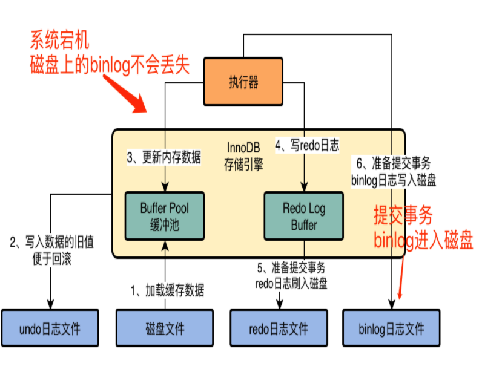
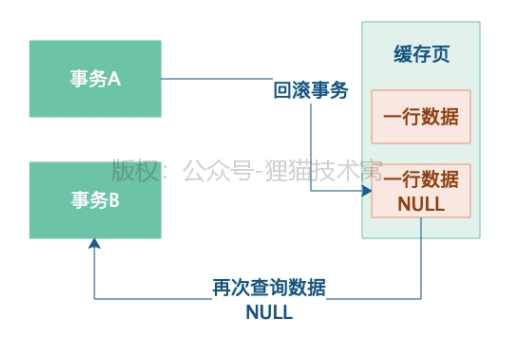
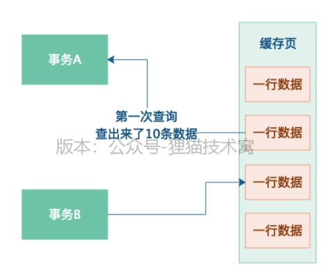
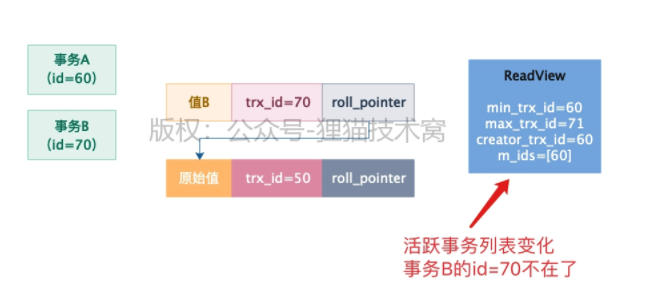

# MySQL实战高手


## 1. SQL执行流程


### 1.1 客户端

+ Tomcat 通过mysql驱动连接MySQL服务器

+ 为了节约开启和关闭mysql连接的开销，Tomcat采用连接池来保存连接


### 1.2 服务端

```mysql
select id, name, age from user where id = 1
```

+ mysql服务端也通过连接池来处理客户端请求
+ mysql工作线程接受到mysql语句以后，就会交给**SQL接口**去执行
+ SQL 语句通过**解析器**被解析
  + 从users里面查询数据
  + 查询id是1的数据
  + 从需要的数据中提取id，name，age三个字段
+ **查询优化器**来优化查询路径
  + 直接定位到user表中id等于1的数据，提取字段
  + 查询user表，提取字段，从中过滤到id等于1的数据
+ **执行器**去调用存储引擎按照一定顺序和步骤执行SQL

+ **存储引擎**负责查询**缓存数据**和查询**磁盘数据**


## 2. InnoDB引擎

### 2.1 缓冲池和undo日志


**undo日志**：记录事务提交之前的值，以便回滚

**缓冲池**：把需要更新或者读取的数据放入缓冲池中，在从磁盘文件加载数据进入缓冲池的时候，需要加锁。


### 2.2 Redo日志

InnoDB 特有的日志文件。redo日志是为了防止机器宕机，缓存数据数据没有刷入磁盘。redo日志用于恢复数据。


**Innodb_flush_log_at_trx_commit=0**，**提交事务的时候不会redo log 刷入磁盘**。如果提交事务成功而**mysql宕机**，内存中的数据和redo日志都会丢失


**Innodb_flush_log_at_trx_commit=1**，**提交事务的时候必须把redo log 刷入磁盘**。如果提交事务成功而**mysql或者机器宕机**，内存中的数据丢失。mysql重启以后可以通过redo日志来恢复数据


**Innodb_flush_log_at_trx_commit=2**，**提交事务的时候必须把redo log 刷os cache**。如果提交事务成功而**机器宕机**，内存中的数据丢失。如果os cache没有把数据刷入磁盘，os cache 和 redo日志都会丢失。


### 2.3 Binlog日志

binlog日志属于mysql server的日志文件


+ 加载数据进入缓冲池
+ 把旧数据写入undo日志
+ 更新内存中的数据
+ 写入redo log buffer
+ 准备提交事务，把redo日志刷入文件
+ 准备提交事务，把binlog日志写入磁盘


**sync_binding 设置为0**，binlog日志不直接进入磁盘，而是写入os cache。如果机器宕机，os cache 和 binlog日志会丢失



**sync_binding 设置为1**，binlog日志直接进入磁盘，而是写入os cache。如果机器宕机 binlog日志不会丢失


### 2.4 基于redo日志和binlog完成事务提交


事务最终提交。把这次更新对应的binlog文件名和更新的binlog日志文件里的位置写入redo log日志里面。同时在redo log 日志里面写入一个commit

**假如5步骤以后宕机**，没有最终事务的标记在redo日志里面，判定这次事务不成功。

**假如6步骤以后宕机**，redo日志没有commit标记，判定事务提交失败

必须redo日志中有事务commit标记，redo日志和binlog完全一致，才判断事务成功。


即使在步骤8，刷入磁盘文件之前宕机了，那么redo日志也会恢复之前事务的提交，IO线程会把已经修改的值放入磁盘数据文件。


## 3. 案例实战：数据库的配置

**数据库部署的时候常选用的机器配置最低在8核16G以上**，正常在16核32G

一般Java应用系统部署在4核8G的机器上，每秒钟抗下500左右的并发访问量，差不多是比较合适的，当然这个也不一定。因为你得考虑一下，假设你每个请求花费1s可以处理完，那么你一台机器每秒也许只可以处理100个请求，但是如果你每个请求只要花费100ms就可以处理完，那么你一台机器每秒也许就可以处理几百个请求。


高并发的情况下，对性能要求极高。对于你Java系统接收到的每个请求，**耗时最多的还是发送网络请求到数据库上去，等待数据库执行一些SQL语句，返回结果给你**。所以其实我们常说你有一个Java系统压力很大，负载很高，但是其实你要明白一点，你这个Java系统其实主要的**压力和复杂都是集中在你依赖的那个MySQL数据库上的！**


因为你执行大量的增删改查的SQL语句的时候，**MySQL数据库需要对内存和磁盘文件进行大量的IO操作**，所以数据库往往是负载最高的！所以往往对一个数据库而言，都是选用8核16G的机器作为起步，最好是选用16核32G的机器更加合适一些，因为数据库需要执行大量的磁盘IO操作，他的每个请求都比较耗时一些，所以机器的配置自然需要高一些了。


## 4. 数据库压测

### 4.1 压测指标

#### Query Per Second

其实就是英文字面意思已经很明确了，QPS就是说，你的这个数据库每秒可以处理多少个请求，你大致可以理解为，一次请求就是一条SQL语句，也就是说这个数据库每秒可以处理多少个SQL语句。


#### Transaction Per Second

每秒可处理的事务量，这个TPS往往是用在数据库中较多一些，其实从字面意思就能看的出来，他就是说数据库每秒会处理多少次事务提交或者回滚。


#### IOPS

这个指的是机器的**随机IO并发处理的能力**，比如机器可以达到200 IOPS，意思就是说每秒可以执行200个随机IO读写请求。在内存中更新的脏数据库，最后都会由**后台IO线程在不确定的时间，刷回到磁盘里去，这就是随机IO的过程**。如果说IOPS指标太低了，那么会导致你内存里的脏数据刷回磁盘的效率就会不高。


#### 吞吐量

这个指的是机器的磁盘存储**每秒可以读写多少字节的数据量**。执行各种SQL语句的时候，提交事务的时候，其实都是大量的会写redo log之类的日志的，这些日志都会直接写磁盘文件。所以一台机器他的存储每秒可以读写多少字节的数据量，**就决定了他每秒可以把多少redo log之类的日志写入到磁盘里去**。一般来说我们写redo log之类的日志，都是对磁盘文件进行顺序写入的，也就是一行接着一行的写，不会说进行随机的读写，那么一般普通磁盘的顺序写入的吞吐量每秒都可以达到200MB左右。


#### latency

这个指标说的是往磁盘里**写入一条数据的延迟**。因为我们执行SQL语句和提交事务的时候，都需要顺序写redo log磁盘文件，所以此时你写一条日志到磁盘文件里去，到底是延迟1ms，还是延迟100us，这就对你的数据库的SQL语句执行性能是有影响的。


### 4.2 Sysbench 进行压测

基于sysbench构造测试表和测试数据

```bash
sysbench --db-driver=mysql --time=300 --threads=10 --report-interval=1 --mysql-host=127.0.0.1 --mysql-port=3306 --mysql-user=root --mysql-password=root --mysql-db=test --tables=20 --table_size=1000000 oltp_read_write --db-ps-mode=disable prepare
```

+ --db-driver=mysql：这个很简单，就是说他基于mysql的驱动去连接mysql数据库，你要是oracle，或者sqlserver，那自然就是其他的数据库的驱动了

+ --time=300：这个就是说连续访问300秒

+ --threads=10：这个就是说用10个线程模拟并发访问

+ --report-interval=1：这个就是说每隔1秒输出一下压测情况

+ --mysql-host=127.0.0.1 --mysql-port=3306 --mysql-user=test_user --mysql-password=test_user：就是说连接到哪台机器的哪个端口上的MySQL库，他的用户名和密码是什么

+ --mysql-db=test_db --tables=20 --table_size=1000000：就是说在test_db这个库里，构造20个测试表，每个测试表里构造100万条测试数据，测试表的名字会是类似于sbtest1，sbtest2这个样子的

+ oltp_read_write：这个就是说，执行oltp数据库的读写测试

+ --db-ps-mode=disable：这个就是禁止ps模式

  

**测试数据库的综合读写TPS，使用的是oltp_read_write**模式

```bash
sysbench --db-driver=mysql --time=300 --threads=10 --report-interval=1 --mysql-host=127.0.0.1 --mysql-port=3306 --mysql-user=root --mysql-password=root --mysql-db=test --tables=20 --table_size=1000000 oltp_read_write --db-ps-mode=disable run
```


**测试数据库的只读性能，使用的是oltp_read_only**模式

```bash
sysbench --db-driver=mysql --time=300 --threads=10 --report-interval=1 --mysql-host=127.0.0.1 --mysql-port=3306 --mysql-user=root --mysql-password=root --mysql-db=test --tables=20 --table_size=1000000 oltp_read_only --db-ps-mode=disable run
```


**测试数据库的删除性能，使用的是oltp_delete**模式：

```bash
sysbench --db-driver=mysql --time=300 --threads=10 --report-interval=1 --mysql-host=127.0.0.1 --mysql-port=3306 --mysql-user=root --mysql-password=root --mysql-db=test --tables=20 --table_size=1000000 oltp_delete --db-ps-mode=disable run
```


**测试数据库的删除性能，使用的是oltp_update_index**模式：

```bash
sysbench --db-driver=mysql --time=300 --threads=10 --report-interval=1 --mysql-host=127.0.0.1 --mysql-port=3306 --mysql-user=root --mysql-password=root --mysql-db=test --tables=20 --table_size=1000000 oltp_update_index --db-ps-mode=disable run
```


**测试数据库的删除性能，使用的是oltp_update_non_index**模式：

```bash
sysbench --db-driver=mysql --time=300 --threads=10 --report-interval=1 --mysql-host=127.0.0.1 --mysql-port=3306 --mysql-user=root --mysql-password=root --mysql-db=test --tables=20 --table_size=1000000 oltp_update_non_index --db-ps-mode=disable run
```


**测试数据库的删除性能，使用的是oltp_insert**模式：

```bash
sysbench --db-driver=mysql --time=300 --threads=10 --report-interval=1 --mysql-host=127.0.0.1 --mysql-port=3306 --mysql-user=root --mysql-password=root --mysql-db=test --tables=20 --table_size=1000000 oltp_insert --db-ps-mode=disable run
```


**测试数据库的删除性能，使用的是oltp_write_only**模式：

```bash
sysbench --db-driver=mysql --time=300 --threads=10 --report-interval=1 --mysql-host=127.0.0.1 --mysql-port=3306 --mysql-user=root --mysql-password=root --mysql-db=test --tables=20 --table_size=1000000 oltp_write_only --db-ps-mode=disable run
```


最后完成压测之后，**可以执行下面的cleanup命令，清理数据。**

```bash
sysbench --db-driver=mysql --time=300 --threads=10 --report-interval=1 --mysql-host=127.0.0.1 --mysql-port=3306 --mysql-user=root --mysql-password=root --mysql-db=test --tables=20 --table_size=1000000 oltp_write_only --db-ps-mode=disable run
```

#### 压测结果

```bash
[ 297s ] thds: 10 tps: 1116.72 qps: 17876.46 (r/w/o: 15644.03/0.00/2232.43) lat (ms,95%): 16.41 err/s: 0.00 reconn/s: 0.00
[ 298s ] thds: 10 tps: 1055.59 qps: 16889.45 (r/w/o: 14777.27/0.00/2112.18) lat (ms,95%): 17.63 err/s: 0.00 reconn/s: 0.00
[ 299s ] thds: 10 tps: 1148.81 qps: 18373.91 (r/w/o: 16076.29/0.00/2297.62) lat (ms,95%): 16.41 err/s: 0.00 reconn/s: 0.00
[ 300s ] thds: 10 tps: 1110.97 qps: 17765.56 (r/w/o: 15545.61/0.00/2219.95) lat (ms,95%): 14.46 err/s: 0.00 reconn/s: 0.00
```

+ thds: 10，这个意思就是有10个线程在压测
+ tps: 1116.72，这个意思就是每秒执行了380.99个事务
+ qps: 17876.46，这个意思就是每秒可以执行7610.20个请求
+ (r/w/o: 15644.03/0.00/2232.43)，这个意思就是说，在每秒17876.46个请求中，有15644.03个请求是读请求，0.00个请求是写请求，2232.43个请求是其他的请求，就是对QPS进行了拆解
+ lat (ms, 95%): 21.33，这个意思就是说，95%的请求的延迟都在14.46毫秒以下
+ err/s: 0.00 reconn/s: 0.00，这两个的意思就是说，每秒有0个请求是失败的，发生了0次网络重连

#### 压测报告

```
SQL statistics:
    queries performed:
        read:                            4738538	// 这就是说在300s的压测期间执行了470万多次的读请求
        write:                           0				// 这是说在压测期间执行了0次的写请求
        other:                           676934		// 这是说在压测期间执行了67次的其他请求
        total:                           5415472	// 这是说在压测期间一共执行了540万次的写请求
    transactions:                        338467 (1128.19 per sec.)
    queries:                             5415472 (18051.05 per sec.)
    ignored errors:                      0      (0.00 per sec.)
    reconnects:                          0      (0.00 per sec.)

// 下面就是说，一共执行了300s的压测，执行了10万+的事务
General statistics:
    total time:                          300.0073s
    total number of events:              338467

Latency (ms):
         min:                                    2.35
         avg:                                    8.86
         max:                                  290.91
         95th percentile:                       20.00
         sum:                              2999396.83

Threads fairness:
    events (avg/stddev):           33846.7000/77.93
    execution time (avg/stddev):   299.9397/0.00

```


#### 压测中的机器性能

**CPU负载**

```
top - 15:52:00 up 42:35, 1 user, load average: 0.15, 0.05, 0.01
```

load average: 0.15, 0.05, 0.01这行信息，他说的是CPU在1分钟、5分钟、15分钟内的负载情况。

这里要给大家着重解释一下这个CPU负载是什么意思，**假设我们是一个4核的CPU**，此时如果你的CPU负载是0.15，这就说明，4核CPU中连一个核都没用满，4核CPU基本都很空闲，没啥人在用。

**如果你的CPU负载是1，那说明4核CPU中有一个核已经被使用的比较繁忙了，另外3个核还是比较空闲一些**。要是CPU负载是1.5，说明有一个核被使用繁忙，另外一个核也在使用，但是没那么繁忙，还有2个核可能还是空闲的。

如果你的CPU负载是4，那说明4核CPU都被跑满了，**如果你的CPU负载是6，那说明4核CPU被繁忙的使用还不够处理当前的任务，很多进程可能一直在等待CPU去执行自己的任务**。


**内存占用**

```
Mem: 33554432k total, 20971520k used, 12268339 free, 307200k buffers
```

这个其实很简单，**明显可以看出来就是总内存大概有32GB，已经使用了20GB左右的内存，还有10多G的内存是空闲的**，然后有大概300MB左右的内存用作OS内核的缓冲区了。

对于内存而言，同样是要在压测的过程中紧密的观察，**一般来说，如果内存的使用率在80%以内，基本都还能接受**，在正常范围内，但是如果你的机器的内存使用率到了70%~80%了，就说明有点危险了，此时就不要继续增加压测的线程数量和QPS了，差不多就可以了。


**磁盘读写**

使用dstat -d命令，会看存储的IO吞吐量是每秒钟读取103kb的数据，每秒写入211kb的数据，像这个存储IO吞吐量基本上都不算多的，因为**普通的机械硬盘都可以做到每秒钟上百MB**的读写数据量。

```bash
-dsk/total -
read writ
103k 211k
  0   11k
```


使用 dstat -r命令，会看到IOPS和写IOPS分别是多少，也就是说随机磁盘读取每秒钟多少次，随机磁盘写入每秒钟执行多少次，大概就是这个意思，一般来说，随机磁盘读写每秒在两三百次都是可以承受的

```bash
--io/total-
read writ
0.25 31.9
  0   253
  0   39.0
```


**网卡占用**

使用 dstat -n命令, 每秒钟网卡接收到流量有多少kb，每秒钟通过网卡发送出去的流量有多少kb，通常来说，如果你的机器使用的是千兆网卡，那么每秒钟网卡的总流量也就在100MB左右，甚至更低一些。

```bash
-net/total-
recv send
16k  17k
```


### 4.3 Prometheus + Grafana 可视化监控

下载prometheus-2.20.0.darwin-amd64, 配置prometheus.yml

```yaml
# my global config
global:
  scrape_interval:     15s # Set the scrape interval to every 15 seconds. Default is every 1 minute.
  evaluation_interval: 15s # Evaluate rules every 15 seconds. The default is every 1 minute.
  # scrape_timeout is set to the global default (10s).

  # Attach these labels to any time series or alerts when communicating with
  # external systems (federation, remote storage, Alertmanager).
  external_labels:
      monitor: 'codelab-monitor'

# Load rules once and periodically evaluate them according to the global 'evaluation_interval'.
rule_files:
  # - "first.rules"
  # - "second.rules"

# A scrape configuration containing exactly one endpoint to scrape:
# Here it's Prometheus itself.
scrape_configs:
  # The job name is added as a label `job=<job_name>` to any timeseries scraped from this config.
  - job_name: 'prometheus'

    # metrics_path defaults to '/metrics'
    # scheme defaults to 'http'.

    static_configs:
      - targets: ['localhost:9090']

  - job_name: mysql
    static_configs:
      - targets: ['127.0.0.1:9104']
        labels:
          instance: db1
```


安装node exporter 并启动**./node_exporter&**

```bash
➜  node_exporter-1.0.1.darwin-amd64 ./node_exporter&
[1] 9625
➜  node_exporter-1.0.1.darwin-amd64 level=info ts=2020-07-25T09:02:10.036Z caller=node_exporter.go:177 msg="Starting node_exporter" version="(version=1.0.1, branch=HEAD, revision=3715be6ae899f2a9b9dbfd9c39f3e09a7bd4559f)"
level=info ts=2020-07-25T09:02:10.036Z caller=node_exporter.go:178 msg="Build context" build_context="(go=go1.14.4, user=root@4c8e5c628328, date=20200616-12:52:07)"
level=info ts=2020-07-25T09:02:10.036Z caller=node_exporter.go:105 msg="Enabled collectors"
level=info ts=2020-07-25T09:02:10.036Z caller=node_exporter.go:112 collector=boottime
level=info ts=2020-07-25T09:02:10.036Z caller=node_exporter.go:112 collector=cpu
level=info ts=2020-07-25T09:02:10.036Z caller=node_exporter.go:112 collector=diskstats
level=info ts=2020-07-25T09:02:10.036Z caller=node_exporter.go:112 collector=filesystem
level=info ts=2020-07-25T09:02:10.036Z caller=node_exporter.go:112 collector=loadavg
level=info ts=2020-07-25T09:02:10.036Z caller=node_exporter.go:112 collector=meminfo
level=info ts=2020-07-25T09:02:10.036Z caller=node_exporter.go:112 collector=netdev
level=info ts=2020-07-25T09:02:10.036Z caller=node_exporter.go:112 collector=textfile
level=info ts=2020-07-25T09:02:10.036Z caller=node_exporter.go:112 collector=time
level=info ts=2020-07-25T09:02:10.036Z caller=node_exporter.go:112 collector=uname
level=info ts=2020-07-25T09:02:10.037Z caller=node_exporter.go:191 msg="Listening on" address=:9100
level=info ts=2020-07-25T09:02:10.037Z caller=tls_config.go:170 msg="TLS is disabled and it cannot be enabled on the fly." http2=false
```

安装mysql exporter 配置**.my.cnf** 并启动 **./mysqld_exporter --config.my-cnf=".my.cnf" &**

```cnf
[client]
host=127.0.0.1
user=root
password=root
```

启动prometheus,  **./prometheus --storage.tsdb.retention=30d &**

```
prometheus-2.20.0.darwin-amd64 level=warn ts=2020-07-25T09:16:23.542Z caller=main.go:297 deprecation_notice="'storage.tsdb.retention' flag is deprecated use 'storage.tsdb.retention.time' instead."
level=info ts=2020-07-25T09:16:23.542Z caller=main.go:343 msg="Starting Prometheus" version="(version=2.20.0, branch=HEAD, revision=e5a06b483527d4fe0704b8fa3a2b475b661c526f)"
level=info ts=2020-07-25T09:16:23.542Z caller=main.go:344 build_context="(go=go1.14.6, user=root@ac954b6d5c6e, date=20200722-19:00:45)"
level=info ts=2020-07-25T09:16:23.542Z caller=main.go:345 host_details=(darwin)
level=info ts=2020-07-25T09:16:23.542Z caller=main.go:346 fd_limits="(soft=65536, hard=65536)"
level=info ts=2020-07-25T09:16:23.542Z caller=main.go:347 vm_limits="(soft=unlimited, hard=unlimited)"
level=info ts=2020-07-25T09:16:23.543Z caller=main.go:684 msg="Starting TSDB ..."
level=info ts=2020-07-25T09:16:23.543Z caller=web.go:524 component=web msg="Start listening for connections" address=0.0.0.0:9090
level=info ts=2020-07-25T09:16:23.548Z caller=head.go:641 component=tsdb msg="Replaying on-disk memory mappable chunks if any"
level=info ts=2020-07-25T09:16:23.548Z caller=head.go:655 component=tsdb msg="On-disk memory mappable chunks replay completed" duration=6.048µs
level=info ts=2020-07-25T09:16:23.548Z caller=head.go:661 component=tsdb msg="Replaying WAL, this may take a while"
level=info ts=2020-07-25T09:16:23.553Z caller=head.go:713 component=tsdb msg="WAL segment loaded" segment=0 maxSegment=4
level=info ts=2020-07-25T09:16:23.578Z caller=head.go:713 component=tsdb msg="WAL segment loaded" segment=1 maxSegment=4
level=info ts=2020-07-25T09:16:23.579Z caller=head.go:713 component=tsdb msg="WAL segment loaded" segment=2 maxSegment=4
level=info ts=2020-07-25T09:16:23.583Z caller=head.go:713 component=tsdb msg="WAL segment loaded" segment=3 maxSegment=4
level=info ts=2020-07-25T09:16:23.583Z caller=head.go:713 component=tsdb msg="WAL segment loaded" segment=4 maxSegment=4
level=info ts=2020-07-25T09:16:23.583Z caller=head.go:716 component=tsdb msg="WAL replay completed" checkpoint_replay_duration=45.611µs wal_replay_duration=35.393816ms total_replay_duration=35.45933ms

```

http://localhost:9090/targets


启动grafanam, **brew services start grafana**

**配置 prometheus数据源**


 从 https://github.com/percona/grafana-dashboards 导入 mysql_overview.json


## 5. 缓存池


Buffer Pool是数据库中的核心组件，因为增删改操作首先就是针对这个内存中的Buffer Pool里的数据执行的，同时配合了后续的redo log、刷磁盘等机制和操作。

所以Buffer Pool就是数据库的一个内存组件，里面缓存了磁盘上的真实数据，然后我们的Java系统对数据库执行的增删改操作，其实主要就是对这个内存数据结构中的缓存数据执行的。


### 5.1 缓冲池数据结构


```properties
[server]
Innodb_buffer_pool_size = 1247483648
```

**数据页**: 磁盘文件中有很多数据页，一个数据页包含多行数据，默认大小16kb

**缓存页**：buffer pool的有缓存页可以和磁盘数据页一一对应，都是16kb

**缓存页描述数据**：**数据页所属表空间，数据页标号**。这个描述信心本身也是一块数据。在buffer pool中，**每个缓存页的描述数据在最前面。然后是每个缓存页。**每个描述数据大概800字节，**描述数据占buffer pool 5%左右**


### 5.2 Free链表


数据库的Buffer Pool包含了很多个缓存页，同时每个缓存页还有一个**描述数据**，也可以叫做是控制数据。

数据库只要一启动，就会按照你设置的Buffer Pool大小，去找操作系统申请一块内存区域，作为Buffer Pool的内存区域。然后当内存区域申请完毕之后，数据库就会按照默认的**缓存页的16KB的大小以及对应的800个字节左右的描述数据的大小**，在Buffer Pool中划分出来一个一个的缓存页和一个一个的他们对应的描述数据。


#### 数据读取

数据库运行起来之后，不停的执行增删改查的操作，此时就需要不停的从磁盘上读取一个一个的数据页放入Buffer Pool中的对应的缓存页里去，把数据缓存起来，那么以后就可以对这个数据在内存里执行增删改查了。因为默认情况下磁盘上的**数据页和缓存页是一 一对应起来的，都是16KB，一个数据页对应一个缓存页**。


刚开始数据库启动的时候，可能所有的缓存页都是空闲的，因为此时可能是一个空的数据库，一条数据都没有，所以此时所有缓存页的描述数据块，都会被放入这个**free链表中**。这个free链表里面就是各个缓存页的描述数据块，只要缓存页是空闲的，那么他们对应的描述数据块就会加入到这个free链表中，每个节点都会双向链接自己的前后节点，**组成一个双向链表**。

这个free链表，他本身其实就是由Buffer Pool里的描述数据块组成的，你可以认为是每个描述数据块里都有两个指针，**一个是free_pre，一个是free_next**，分别指向自己的上一个free链表的节点，以及下一个free链表的节点。


磁盘上的数据页读取到对应的缓存页里去，同时把相关的一些描述数据写入缓存页的描述数据块里去，比如这个数据页所属的表空间之类的信息，**最后把那个描述数据块从free链表里去除**。


#### 数据页缓存哈希表

**数据库还会有一个哈希表数据结构，他会用表空间号+数据页号，作为一个key，然后缓存页的地址作为value。**当你要使用一个数据页的时候，通过**“表空间号+数据页号”作为key**去这个哈希表里查一下，如果没有就读取数据页，如果已经有了，就说明数据页已经被缓存了。


### 5.3 Flush链表


**脏页**

更新的数据页都会在Buffer Pool的缓存页里，供在内存中直接执行增删改的操作。**接着你肯定会去更新Buffer Pool的缓存页中的数据**，此时一旦**更新了缓存页中的数据，那么缓存页里的数据和磁盘上的数据页里的数据，是不是就不一致了**。这个时候，我们就说缓存页是脏数据，脏页

数据库在这里引入了另外一个跟free链表类似的**flush链表**，这个flush链表本质也是通过缓存页的描述数据块中的两个指针，让被修改过的缓存页的描述数据块，**组成一个双向链表**。

凡是被修改过的缓存页，都会把他的描述数据块加入到flush链表中去，flush的意思就是这些都是脏页，后续都是要flush刷新到磁盘上去的


### 5.4 LRU策略淘汰缓存


因为只要你把一个数据页加载到一个空闲缓存页里去，free链表中就会减少一个空闲缓存页。所以，当你不停的把磁盘上的数据页加载到空闲缓存页里去，**free链表中不停的移除空闲缓存页，迟早有那么一瞬间，你会发现free链表中已经没有空闲缓存页了**

此时无法从磁盘上加载新的数据页到缓存页里去了，那么此时你只有一个办法，就是**淘汰掉一些缓存页**。你必**须把一个缓存页里被修改过的数据，给他刷到磁盘上的数据页里去，然后这个缓存页就可以清空了，让他重新变成一个空闲的缓存页**。


引入一个新的LRU链表了，**这个所谓的LRU就是Least Recently Used**，最近最少使用的意思。假设我们从磁盘加载一个数据页到缓存页的时候，就把这个缓存页的描述数据块放到LRU链表头部去，那么只要有数据的缓存页，他都会在LRU里了，而且最近被加载数据的缓存页，都会放到LRU链表的头部去。后续你只要查询或者修改了这个缓存页的数据，也要把这个缓存页挪动到LRU链表的头部去，也就是说最近被访问过的缓存页，一定在LRU链表的头部。


当缓存页没有一个空闲的时候，要找出来那个最近最少被访问的缓存页去刷入磁盘？此时你就直接**在LRU链表的尾部找到一个缓存页，他一定是最近最少被访问的那个缓存页！**


#### 简单LRU算法问题


一个LRU机制在实际运行过程中，是会存在巨大的隐患的。

假设现在有两个空闲缓存页，然后在加载一个数据页的时候，**连带着把他的一个相邻的数据页也加载到缓存里去了，正好每个数据页放入一个空闲缓存页**。但是接下来呢，实际上只有一个缓存页是被访问了，另外一个**通过预读机制加载的缓存页，其实并没有人访问**，此时这两个缓存页可都在LRU链表的前面。

假如没有空闲缓存页了，那么此时要加载新的数据页了，是不是就要从LRU链表的尾部把所谓的“最近最少使用的一个缓存页”给拿出来，刷入磁盘，然后腾出来一个空闲缓存页了。

这个时候，**如果你把上图中LRU尾部的那个缓存页刷入磁盘然后清空其实并不合理。他可是之前一直频繁被人访问的啊！**只不过在这一个瞬间，被新加载进来的两个缓存页给占据了LRU链表前面的位置，尤其是第二个缓存页，居然还是通过预读机制加载进来的，根本就不会有人访问！

**预加载读**

+ 有一个参数是innodb_read_ahead_threshold，他的默认值是56，意思就是**如果顺序的访问了一个区里的多个数据页，访问的数据页的数量超过了这个阈值，此时就会触发预读机制**，把下一个相邻区中的所有数据页都加载到缓存里去
+ **如果Buffer Pool里缓存了一个区里的13个连续的数据页**，而且这些数据页都是比较频繁会被访问的，此时就会直接触发预读机制，把这个区里的其他的数据页都加载到缓存里去
+ innodb_read_ahead_threshold默认是关闭的
+ 全表扫描


#### 冷热数据的LRU链表

所以真正的LRU链表，会被拆分为两个部分，一部分是热数据，一部分是冷数据，这个冷热数据的比例是由**innodb_old_blocks_pct**参数控制的，他默认是37，也就是说冷数据占比37%。

这个时候，LRU链表实际上看起来是下面这样子的。


首先数据页第一次被加载到缓存的时候，**缓存页会被放在冷数据区域的链表头部**。

如果你刚加载了一个数据页到那个缓存页，他是在冷数据区域的链表头部，然后立马（在1ms以内）就访问了一下这个缓存页，之后就再也不访问他了呢，这样也是不合理的。

MySQL设定了一个规则，他设计了一个**innodb_old_blocks_time**参数，默认值1000，也就是1000毫秒

+ 必须是一个数据页被加载到缓存页之后，在1s之后，你访问这个缓存页，他才会被挪动到热数据区域的链表头部去。因为假设你加载了一个数据页到缓存去，然后过了1s之后你还访问了这个缓存页，说明你后续很可能会经常要访问它，这个时间限制就是1s.

+ **在1s内你就访问缓存页，此时他是不会把这个缓存页放入热数据区域的头部的。**


#### LRU链表冷热数据区域优化

接着我们来看看LRU链表的热数据区域的一个性能优化的点，就是说，在热数据区域中，如**果你访问了一个缓存页，是不是应该要把他立马移动到热数据区域的链表头部去，但是其实没有必要**。热数据区域里的缓存页可能是经常被访问的，所以这么频繁的进行移动是不是性能也并不是太好？也没这个必要。

LRU链表的热数据区域的访问规则被优化了一下，**即你只有在热数据区域的后3/4部分的缓存页被访问了**，才会给你移动到链表头部去。


#### LRU链表中尾部的缓存页淘汰机制


**冷数据区域**

并不是在缓存页满的时候，才会挑选LRU冷数据区域尾部的几个缓存页刷入磁盘**，而是有一个后台线程，他会运行一个定时任务，这个定时任务每隔一段时间就会把LRU链表的冷数据区域的尾部的一些缓存页**，刷入磁盘里去，清空这几个缓存页，把他们加入回free链表去！


**热数据区域**

如果仅仅是把LRU链表中的冷数据区域的缓存页刷入磁盘，明显不够啊，因为在lru链表的**热数据区域里的很多缓存页可能也会被频繁的修改**，难道他们永远都不刷入磁盘中了吗？所以这个后台线程同时也会在MySQL不怎么繁忙的时候，**找个时间把flush链表中的缓存页都刷入磁盘中**，这样被你修改过的数据，迟早都会刷入磁盘的！**只要flush链表中的一波缓存页被刷入了磁盘，那么这些缓存页也会从flush链表和lru链表中移除，然后加入到free链表中去！**


**没有空闲缓存页**

可能所有的free链表都被使用了，然后flush链表中有一大堆被修改过的缓存页，lru链表中有一大堆的缓存页，根据冷热数据进行了分离，大致是如此的效果。这个时候如果要从磁盘加载数据页到一个空闲缓存页中**，此时就会从LRU链表的冷数据区域的尾部找到一个缓存页，他一定是最不经常使用的缓存页！然后把他刷入磁盘和清空，然后把数据页加载到这个腾出来的空闲缓存页里去！**


### 5.5 生产经验

#### 多个buffer pool 优化并发


现在多个线程来并发的访问这个Buffer Pool了，此时他们都是在访问内存里的一些共享的数据结构，比如说缓存页、各种链表之类的。多线程并发访问一个Buffer Pool，必然是要加锁的，然后让一个线程先完成一系列的操作，比如说加载数据页到缓存页，更新free链表，更新lru链表，然后释放锁，接着下一个线程再执行一系列的操作。


即使就一个Buffer Pool，即使多个线程会加锁串行着排队执行，其实性能也差不到哪儿去。因为大部分情况下，**每个线程都是查询或者更新缓存页里的数据，这个操作是发生在内存里的，基本都是微秒级的**，很快很快，包括更新free、flush、lru这些链表，他因为都是基于链表进行一些指针操作，性能也是极高的。

```properties
[server]
innodb_buffer_pool_size = 8589934592
innodb_buffer_pool_instances = 4
```

我们给buffer pool设置了8GB的总内存，然后设置了他应该有4个Buffer Pool，此时就是说，每个buffer pool的大小就是2GB。这个时候，MySQL在运行的时候就会有4个Buffer Pool了！每个Buffer Pool负责管理一部分的缓存页和描述数据块，有自己独立的free、flush、lru等链表。


#### 基于chunk动态调整buffer pool

因为动态调整buffer pool大小，比如buffer pool本来是8G，运行期间你给调整为16G了，此时是怎么实现的呢。 就是需要这个时候向操作系统申请一块新的16GB的连续内存，**然后把现在的buffer pool中的所有缓存页、描述数据块、各种链表，都拷贝到新的16GB的内存中去。这个过程是极为耗时的，性能很低下，是不可以接受的！**


MySQL设计了一个chunk机制，也就是说buffer pool是由很多chunk组成的，他的大小是**innodb_buffer_pool_chunk_size**参数控制的，默认值就是**128MB**。假设我们给buffer pool设置一个总大小是8GB，然后有4个buffer pool，那么每个buffer pool就是2GB，此时每个buffer pool是由一系列的128MB的chunk组成的，也就是说每个**buffer pool会有16个chunk。**然后每个buffer pool里的每个chunk里就是一系列的描述数据块和缓存页，每个buffer pool里的多个chunk共享一套free、flush、lru这些链表，此时的话，看起来可能大致如下图所示。

**只要申请一系列的128MB大小的chunk就可以了，只要每个chunk是连续的128MB内存就行了。然后把这些申请到的chunk内存分配给buffer pool就行了。**


#### 生产环境buffer pool参数

建议一个比较合理的、健康的比例，是给buffer pool设置你的机器内存的50%~60%左右。比如你有32GB的机器，那么给buffer设置个20GB的内存，剩下的留给OS和其他人来用，这样比较合理一些。


接着确定了buffer pool的总大小之后，就得考虑一下设置多少个buffer pool，以及chunk的大小了。此时要记住，有一个很关键的公式就是：**buffer pool总大小=(chunk大小 * buffer pool数量)的倍数**

假设你的buffer pool的数量是16个，这是没问题的，那么此时**chunk大小 * buffer pool的数量 = 16 * 128MB = 2048MB**，然后buffer pool总大小如果是20GB，此时buffer pool总大小就是2048MB的10倍，这就符合规则了。


**SHOW ENGINE INNODB STATUS**

```
----------------------
BUFFER POOL AND MEMORY
----------------------
Total large memory allocated 274857984
Dictionary memory allocated 244224
Buffer pool size   16382
Free buffers       110
Database pages     16063
Old database pages 5948
Modified db pages  8885
Pending reads      0
Pending writes: LRU 0, flush list 0, single page 0
Pages made young 2987, not young 35398
149.34 youngs/s, 1769.81 non-youngs/s
Pages read 24749, created 542, written 4488
1146.04 reads/s, 25.40 creates/s, 222.59 writes/s
Buffer pool hit rate 962 / 1000, young-making rate 5 / 1000 not 59 / 1000
Pages read ahead 0.00/s, evicted without access 0.00/s, Random read ahead 0.00/s
LRU len: 16063, unzip_LRU len: 0
I/O sum[12500]:cur[990], unzip sum[0]:cur[0]
--------------
ROW OPERATIONS
--------------
0 queries inside InnoDB, 0 queries in queue
10 read views open inside InnoDB
Process ID=12665, Main thread ID=123145416486912, state: sleeping
Number of rows inserted 2448, updated 4896, deleted 2448, read 1020824
122.39 inserts/s, 244.79 updates/s, 122.39 deletes/s, 51038.25 reads/s
----------------------------
END OF INNODB MONITOR OUTPUT
============================


```


+ **Total memory allocated**，这就是说buffer pool最终的总大小是多少
+ **Buffer pool size**，这就是说buffer pool一共能容纳多少个缓存页
+ **Free buffers**，这就是说free链表中一共有多少个空闲的缓存页是可用的
+ **Database pages和Old database pages**，就是说lru链表中一共有多少个缓存页，以及冷数据区域里的缓存页数量
+ **Modified db pages**，这就是flush链表中的缓存页数量
+ **Pending reads和Pending writes**，等待从磁盘上加载进缓存页的数量，还有就是即将从lru链表中刷入磁盘的数量、即将从flush链表中刷入磁盘的数量
+ **Pages made young和not young**，这就是说已经lru冷数据区域里访问之后转移到热数据区域的缓存页的数量，以及在lru冷数据区域里1s内被访问了没进入热数据区域的缓存页的数量
+ **youngs/s和not youngs/s**，这就是说每秒从冷数据区域进入热数据区域的缓存页的数量，以及每秒在冷数据区域里被访问了但是不能进入热数据区域的缓存页的数量
+ Pages read xxxx, created xxx, written xxx，xx reads/s, xx creates/s, 1xx writes/s，这里就是说已经读取、创建和写入了多少个缓存页，以及每秒钟读取、创建和写入的缓存页数量
+ **Buffer pool hit rate xxx / 1000**，这就是说每1000次访问，有多少次是直接命中了buffer pool里的缓存的

+ **young-making rate xxx / 1000 not xx / 1000**，每1000次访问，有多少次访问让缓存页从冷数据区域移动到了热数据区域，以及没移动的缓存页数量
+ LRU len：这就是lru链表里的缓存页的数量
+ I/O sum：最近50s读取磁盘页的总数
+ I/O cur：现在正在读取磁盘页的数量


## 6. 磁盘存储模型

一个请求就直接对磁盘文件进行随机读写，然后更新磁盘文件里的数据，但是那必然导致执行请求的性能极差。**因为磁盘随机读写的性能是最差的**，所以直接更新磁盘文件，必然导致我们的数据库完全无法抗下任何一点点稍微高并发一点的场景。所以MySQL才设计了如此复杂的一套机制，通过内存里更新数据，然后写redo log以及事务提交，后台线程不定时刷新内存里的数据到磁盘文件里。通过这种方式保证，你每个更新请求，**尽量就是更新内存，然后顺序写日志文件**。


### 6.1 COMPACT存储格式

```sql
CREATE TABLE table_name (columns) ROW_FORMAT=COMPACT
ALTER TABLE table_name ROW_FORMAT=COMPACT
```

变长字段的长度列表，null值列表，数据头，column01的值，column02的值，column0n的值......


### 6.2 变长字段长度列表

现在有一行数据，他的几个字段的类型为VRACHAR(10)，CHAR(1)，CHAR(1)，那么他第一个字段是VARCHAR(10)，这个长度是可能变化的，所以这一行数据可能就是类似于：**hello a a**。另外一行数据，同样也是这几个字段，他的第一个字段的值可能是“hi”，后面两个字段也是“a”，所以这一行数据可能是类似于：**hi a a**。一共三个字段，第一个字段的长度是是不固定的，后面两个字段的长度都是固定的1个字符。


hello”的长度是5，十六进制就是0x05，“hello a a” 格式是0x05 null值列表 数据头 hello a a。0x02 null值列表 数据头 hi a a

```
0x05 null值列表 数据头 hello a a 0x02 null值列表 数据头 hi a a
```


比如一行数据有VARCHAR(10) VARCHAR(5) VARCHAR(20) CHAR(1) CHAR(1)，一共5个字段，其中三个是变长字段，此时假设一行数据是这样的：hello hi hao a a。**现在hello hi hao三个字段的长度分别是0x05 0x02 0x03**，但是实际存放在变长字段长度列表的时候，是**逆序放的**，所以一行数据实际存储可能是下面这样的：

```
0x03 0x02 0x05 null值列表 头字段 hello hi hao a a
```


### 6.3 NULL存储

```SQL
CREATE TABLE customer (
name VARCHAR(10) NOT NULL,
address VARCHAR(20),
gender CHAR(1),
job VARCHAR(30),
school VARCHAR(50)
) ROW_FORMAT=COMPACT;
```

“jack NULL m NULL xx_school”，他的5个字段里有两个字段都是NULL。有name和school两个变长字段是有值的，把他们的长度按照逆序放在变长字段长度列表中就可以了，如下所示：

```
0x09 0x04 NULL值列表 头信息 column1=value1 column2=value2 ... columnN=valueN
```

NULL值列表，这个NULL值列表是这样存放的，你所有允许值为NULL的字段，注意，是允许值为NULL，不是说一定值就是NULL了，只要是允许你为NULL的字段，在这里每个字段都有一个二进制bit位的值，**如果bit值是1说明是NULL，如果bit值是0说明不是NULL。**这一行数据的值是“jack NULL m NULL xx_school”，然后其中2个字段是null，2个字段不是null，所以**4个bit位应该是：1010**。**实际放在NULL值列表的时候，他是按逆序放的**，所以在NULL值列表里，放的是：**0101**

```
0x09 0x04 0101 头信息 column1=value1 column2=value2 ... columnN=valueN
```


### 6.4 数据头

每一行数据存储的时候，还得有40个bit位的数据头，这个数据头是用来描述这行数据的。40个bit位里，

+ 第一个bit位和第二个bit位，都是预留位，是没任何含义的。
+ 1个bit位是**delete_mask**，他标识的是这行数据是否被删除了，其实看到这个bit位，很多人可能已经反映过来了，这么说在MySQL里删除一行数据的时候，未必是立马把他从磁盘上清理掉，而是给他在数据头里搞1个bit标记
+ 1个bit位是**min_rec_mask**，就是说在B+树里每一层的非叶子节点里的最小值都有这个标记。
+ 4个bit位是**n_owned**
+ 13个bit位是**heap_no**，他代表的是当前这行数据在记录堆里的位置
+ 3个bit位的**record_type**，这就是说这行数据的类型, 0代表的是普通类型，1代表的是B+树非叶子节点，2代表的是最小值数据，3代表的是最大值数据
+ 16个bit的**next_record**，这个是指向他下一条数据的指针。


### 6.5 其他字段

数据是“jack NULL m NULL xx_school”, 实际上字符串这些东西都是根据我们数据库指定的字符集编码，进行编码之后再存储的

```
0x09 0x04 00000101 0000000000000000000010000000000000011001 616161 636320 6262626262
```

在实际存储一行数据的时候，会在他的真实数据部分，加入一些隐藏字段

+ **DB_ROW_ID字段**，这就是一个行的唯一标识，是他数据库内部给你搞的一个标识，不是你的主键ID字段。如果我们没有指定主键和unique key唯一索引的时候，他就内部自动加一个ROW_ID作为主键。
+ **DB_TRX_ID字段**，这是跟事务相关的，他是说这是哪个事务更新的数据，这是事务ID，这个后续我们讲解到事务的时候会跟大家说
+ **DB_ROLL_PTR字段**，这是回滚指针，是用来进行事务回滚的，也是我们后续在讲解事务的时候再详细说。


每一行数据是不是就是类似

```
0x09 0x04 00000101 0000000000000000000010000000000000011001 00000000094C（DB_ROW_ID）00000000032D（DB_TRX_ID） EA000010078E（DB_ROL_PTR）  616161 636320 6262626262
```


### 6.6 行溢出

比如有一个表的字段类型是VARCHAR(65532)，意思就是最大可以包含65532个字符，那也就是65532个字节，这就远大于16kb的大小了，也就是说这一行数据的这个字段都远超一个数据页的大小了！

这个时候实际上会在那一页里存储你这行数据，然后在那个字段中，仅仅包含他一部分数据，**同时包含一个20个字节的指针，指向了其他的一些数据页**，那些数据页用链表串联起来，存放这个VARCHAR(65532)超大字段里的数据。


### 6.7 数据页

16kb的数据页包含了文件头、数据页头、最小记录和最大记录、多个数据行、空闲空间、数据页目录、文件尾部。


+ 文件头占据了38个字节
+ 数据页头占据了56个字节
+ 最大记录和最小记录占据了26个字节
+ 数据行区域的大小是不固定的，空闲区域的大小也是不固定的，数据页目录的大小也是不固定的
+ 文件尾部占据8个字节。


假设我们现在要插入一行数据，此时数据库里可是一行数据都没有的，那么此时应该先是从磁盘上加载一个空的数据页到缓存页里。缓存页跟数据页是一 一对应的，他在磁盘上的时候就是数据页，数据页加载到缓存页里了，我们就叫他缓存页了。

此时在缓存页里插入一条数据，实际上就是在数据行那个区域里插入一行数据，然后空闲区域的空间会减少一些，此时当缓存页里插入了一行数据之后。


### 6.8 表空间

自己创建的表对应的表空间可能就是对应了一个“表名.ibd”数据文件。一个表空间的磁盘文件里，其实是有很多的数据页的。一个表空间里包含的数据页实在是太多了，不便于管理，所以在表空间里又引入了一个**数据区**的概念，英文就是**extent**

**一个数据区对应着连续的64个数据页**，每个数据页是16kb，所以一个数据区是1mb，然后256个数据区被划分为了一组。

对于表空间而言，他的第一组数据区的第一个数据区的前3个数据页，都是固定的，里面存放了一些描述性的数据。

+ **FSP_HDR**这个数据页，他里面就存放了表空间和这一组数据区的一些属性。
+ **IBUF_BITMAP**数据页，里面存放的是这一组数据页的所有insert buffer的一些信息。
+ **INODE**数据页，这里也是存放了一些特殊的信息

当我们需要执行crud操作的时候，说白了，就是从磁盘上的表空间的数据文件里，去加载一些数据页出来到Buffer Pool的缓存页里去使

**表空间存储结构如下**


### 6.9 顺序读写与随机读写

MySQL在实际工作时候的两种数据读写机制，一种是对redo log、binlog这种日志进行的磁盘顺序读写，一种是对表空间的磁盘文件里的数据页进行的磁盘随机读写。


#### 随机读写

MySQL在工作的时候，尤其是执行增删改操作的时候，肯定会先从表空间的磁盘文件里读取数据页出来，这个过程其实就是典型的磁盘随机读操作，随机的位置读取一个数据页到缓存，这就是**磁盘随机读**。磁盘随机读的性能是比较差的，所以不可能每次更新数据都进行磁盘随机读，必须是读取一个数据页之后放到Buffer Pool的缓存里去，下次要更新的时候直接更新Buffer Pool里的缓存页。

对于磁盘随机读来说，主要关注的性能指标是**IOPS和响应延迟**

**IOPS**就是说底层的存储系统每秒可以执行多少次磁盘读写操作，**底层存储的IOPS越高，你的数据库的并发能力就越高**。

**响应延迟**，推荐用SSD固态硬盘的，而不是机械硬盘，因为SSD固态硬盘的随机读写并发能力和响应延迟要比机械硬盘好的多


#### 顺序读写

磁盘顺序写的性能其实是很高的，某种程度上来说，几乎可以跟内存随机读写的性能差不多，尤其是在数据库里其实也用了os cache机制，就是redo log顺序写入磁盘之前，先是进入os cache，就是操作系统管理的内存缓存里。最核心关注的是磁盘每秒读写多少**数据量的吞吐量指标**，就是说每秒可以写入磁盘100MB数据和每秒可以写入磁盘200MB数据，对数据库的并发能力影响也是极大的。


## 7. Linux存储和IO调优

### 7.1 存储结构

Linux的存储系统分为VFS层、文件系统层、Page Cache缓存层、通用Block层、IO调度层、Block设备驱动层、Block设备层


当MySQL发起一次数据页的随机读写，或者是一次redo log日志文件的顺序读写的时候，实际上会把磁盘IO请求交给Linux操作系统的VFS层

**VPS层的作用，就是根据你是对哪个目录中的文件执行的磁盘IO操作，把IO请求交给具体的文件系统。**

举个例子，在linux中，有的目录比如/xx1/xx2里的文件其实是由NFS文件系统管理的，有的目录比如/xx3/xx4里的文件其实是由Ext3文件系统管理的，那么这个时候VFS层需要根据你是对哪个目录下的文件发起的读写IO请求


**文件系统会先在Page Cache这个基于内存的缓存里找你要的数据在不在里面**，如果有就基于内存缓存来执行读写，如果没有就继续往下一层走


请求会交给通用Block层，在这一层会把你对**文件的IO请求转换为Block IO请求**


IO请求转换为Block IO请求之后，会把这个Block IO请求交给**IO调度层**，在这一层里**默认是用CFQ公平调度算法**的。有一个SQL语句可能非常简单，比如update xxx set xx1=xx2 where id=1，他其实可能就只要更新磁盘上的一个block里的数据就可以了。但是有的SQL语句，比如说select * from xx where xx1 like "%xx%"可能需要IO读取磁盘上的大量数据。

那么此时如果基于公**平调度算法，就会导致他先执行第二个SQL语句的读取大量数据的IO操作，耗时很久，然后第一个仅仅更新少量数据的SQL语句的IO操作，就一直在等待他**，得不到执行的机会。一般建议**MySQL的生产环境，需要调整为deadline IO调度算法**，他的核心思想就是，任何一个IO操作都不能一直不停的等待，在指定时间范围内，都必须让他去执行


最后IO完成调度之后，就会决定哪个IO请求先执行，哪个IO请求后执行，此时可以执行的**IO请求就会交给Block设备驱动层**，然后最后经过驱动把IO请求发送给真正的存储硬件，也就是Block设备层


### 7.2 RAID存储结构


其实有的RAID磁盘冗余阵列技术里，是可以把你写入的同样一份数据，在两块磁盘上都写入的，这样可以让两块磁盘上的数据一样，作为冗余备份，然后当你一块磁盘坏掉的时候，可以从另外一块磁盘读取冗余数据出来，这一切都是RAID技术自动帮你管理的，不需要你操心，


#### RAID 0

RAID 0的意思，就是我们之前一幅图里画的，你有很多磁盘组成了一个阵列，然后你所有的数据是分散写入不同磁盘的，因为有多块磁盘，所以你的磁盘阵列的整体容量就很大，而且同时写入多块磁盘，让你的磁盘读写并发能力很强


这种模式下，最大的问题就是万一你磁盘坏了一块，那么就会丢失一部分数据了！所以一般如果你要严格保证磁盘数据不丢失的话，就得用RAID 1。


#### RAID 1


RAID 1的意思，就是两块磁盘为镜像关系，你写的所有数据，在两块磁盘上都有，形成了数据冗余，一块磁盘坏了，另外一块磁盘上还有数据。


#### RAID 10


**RAID 10，就是RAID 0 + RAID 1组合起来**，就是说当时生产环境的服务器部署，我们有6块磁盘组成了一个RAID 10的阵列，那么其实就是每2块磁盘组成一个RAID 1互为镜像的架构，存放的数据是冗余一样的，一共有3组RAID 1，然后对于每一组RAID 1写入数据的时候，是用RAID 0的思路，就是不同组的磁盘的数据是不一样的，但是同一组内的两块磁盘的数据是冗余一致的


## 8. 案例分析：RAID 锂电池放电引发的数据库抖动


RAID卡一般都配置有自己独立的锂电池或者是电容，如果服务器突然掉电了，无法接通电源了，RAID卡自己是基于锂电池来供电运行的，然后他会赶紧把缓存里的数据写入到阵列中的磁盘上去。 

但是**锂电池是存在性能衰减问题的，所以一般来说锂电池都是要配置定时充放电的**，也就是说**每隔30天~90天**（不同的锂电池厂商是不一样的），就会自动对锂电池充放电一次，这可以延长锂电池的寿命和校准电池容量。如果你要是不这么做的话，那么可能锂电池用着用着就会发现容量不够了，可能容纳的电量在你服务器掉电之后，都没法一次性把缓存里的数据写回磁盘上去，那就会导致数据丢失了！

锂电池充放电的过程中，**RAID的缓存级别会从write back变成write through**，我们通过RAID写数据的时候，IO就直接写磁盘了，如果写内存的话，性能也就是0.1ms这个级别，但是直接写磁盘，就性能退化10倍到毫秒级了！


+ **给RAID卡把锂电池换成电容**，电容是不用频繁充放电的，不会导致充放电的性能抖动，还有就是电容可以支持透明充放电，就是自动检查电量，自动进行充电，不会说在充放电的时候让写IO直接走磁盘，但是更换电容很麻烦，而且**电容比较容易老化，其实一般不常用**
+ **手动充放电**，这个比较常用，包括一些大家知道的顶尖互联网大厂的数据库服务器的RAID就是**用了这个方案避免性能抖动，就是关闭RAID自动充放电，然后写一个脚本，脚本每隔一段时间自动在晚上凌晨的业务低峰时期**，脚本手动触发充放电，这样可以避免业务高峰期的时候RAID自动充放电引起性能抖动
+ 充放电的时候不要关闭write back，就是设置一下，**锂电池充放电的时候不要把缓存级别从write back修改为write through**，这个也是可以做到的，可以和第二个策略配合起来使用


## 9. 案例分析：数据库无法连接Too many connections

据库部署在64GB的大内存物理机上，机器配置各方面都很高，然后连接这台物理机的Java系统部署在2台机器上，Java系统设置的连接池的最大大小是200，也就是说每台机器上部署的Java系统，最多跟MySQL数据库建立200个连接，一共最多建立400个连接


MySQL报异常说Too many Connections，就说明目前MySQL甚至都无法建立400个网络连接。于是我们检查了一下MySQL的配置文件，my.cnf，里面有一个关键的参数是**max_connections**，就是MySQL能建立的最大连接数，设置的是**800**。

> Could not increase number of max_open_files to more than mysqld (request: 65535)
> Changed limits: max_connections: 214 (requested 2000)
> Changed limits: table_open_cache: 400 (requested 4096)


MySQL发现自己无法设置max_connections为我们期望的800，只能强行限制为214了！这是为什么呢？简单来说，就是因为底层的linux操作系统把进程可以打开的**文件句柄数限制为了1024了，导致MySQL最大连接数是214**！

```bash
ulimit -HSn 65535
cat /etc/security/limits.conf
cat /etc/rc.local
```

因为如果linux限制你一个进程的文件句柄太少的话，那么就会导致我们没办法创建大量的网络连接，此时我们的系统进程就没法正常工作了

举个例子，比如MySQL运行的时候，其实就是linux上的一个进程，那么他其实是需要跟很多业务系统建立大量的连接的，结果你限制了他的最大文件句柄数量，那么他就不能建立太多连接了！

所以说，往往你在生产环境部署了一个系统，比如**数据库系统、消息中间件系统、存储系统、缓存系统之后，都需要调整一下linux的一些内核参数**，这个文件句柄的数量是一定要调整的，**通常都得设置为65535**

所以我们平时可以用ulimit命令来设置每个进程被限制使用的资源量，用**ulimit -a**就可以看到进程被限制使用的各种资源的量


## 10. Redo 日志

### 10.1 Redo日志机制

更新完Buffer Pool中的缓存页之后，必须要写一条redo log，这样才能记录下来我们对数据库做的修改。

redo log可以保证我们事务提交之后，如果事务中的增删改SQL语句更新的缓存页还没刷到磁盘上去，此时MySQL宕机了，那么MySQL重启过后，就可以把redo log重做一遍，恢复出来事务当时更新的缓存页，然后再把缓存页刷到磁盘就可以了。redo log本质是保证事务提交之后，修改的数据绝对不会丢失的。


redo log机制，这个机制就是说，你提交事务的时候，绝对是保证把你对缓存页做的修改以日志的形式，写入到redo log日志文件里去的。这种日志大致的格式如下：对表空间XX中的数据页XX中的偏移量为XXXX的地方更新了数据XXX。只要你事务提交的时候保证你做的修改以日志形式写入redo log日志，那么哪怕你此时突然宕机了，也没关系！

因为你MySQL重启之后，把你之前事务更新过做的修改根据redo log在Buffer Pool里重做一遍就可以了，就可以恢复出来当时你事务对缓存页做的修改，然后找时机再把缓存页刷入磁盘文件里去。

实际上，**如果你把修改过的缓存页都刷入磁盘，这首先缓存页一个就是16kb，数据比较大**，刷入磁盘比较耗时，而且你可能就修改了缓存页里的几个字节的数据，难道也把完整的缓存页刷入磁盘吗。而且**你缓存页刷入磁盘是随机写磁盘**，性能是很差的


### 10.2 Redo日志格式

redo log就划分为了不同的类型

+ MLOG_1BYTE类型的日志指的就是修改了1个字节的值
+ MLOG_2BYTE类型的日志指的就是修改了2个字节的值，以此类推，还有修改了4个字节的值的日志类型，修改了8个字节的值的日志类型。
+ 修改了一大串的值，类型就是**MLOG_WRITE_STRING**，就是代表你一下子在那个数据页的某个偏移量的位置插入或者修改了一大串的值。

```
日志类型（就是类似MLOG_1BYTE之类的），表空间ID，数据页号，数据页中的偏移量，具体修改的数据
```


### 10.3 Redo Block

MySQL内有另外一个数据结构，叫做**redo log block**，大概你可以理解为，平时我们的数据不是存放在数据页了的么，用一页一页的数据页来存放数据。那么对于redo log也不是单行单行的写入日志文件的，他是用一个redo log block来存放多个单行日志的。

12字节的header头又分为了4个部分。

+ 4个字节的**block no**，就是块唯一编号；
+ 2个字节的**data length**，就是block里写入了多少字节数据；
+ 2个字节的**first record group**。这个是说每个事务都会有多个redo log，是一个redo log group，即一组redo log。那么在这个block里的**第一组redo log的偏移量**，就是这2个字节存储的；
+ 4个字节的checkpoint on


每一个redo log都是写入到文件里的一个redo log block里去的，**一个block最多放496自己的redo log日志**。


一个redo log block就是512字节，那么真正写入的时候，把这个redo log block的512字节的数据，就写入到redo log文件里去就可以了。那么redo log文件里就多了一个block。**日志文件里是存放一个又一个的redo log block的**


### 10.4 Redo Log Buffer


这个redo log到底是如何通过内存缓冲之后，再进入磁盘文件里去的，这就涉及到了一个新的组件，**redo log buffer，他就是MySQL专门设计了用来缓冲redo log写入的。**

这个redo log buffer其实就是MySQL在启动的时候，就跟操作系统申请的一块**连续内存空间**.

通过设置mysql的**innodb_log_buffer_size**可以指定这个redo log buffer的大小，**默认的值就是16MB**，其实已经够大了，毕竟一个redo log block才512自己而已，每一条redo log其实也就几个字节到几十个字节罢了。

写满了一个redo log block，就会继续写下一个redo log block，以此类推，直到所有的redo log block都写满。**万一要是redo log buffer里所有的redo log block都写满了呢。那此时必然会强制把redo log block刷入到磁盘中去的**！


其实在我们平时执行一个事务的过程中，每个事务会有多个增删改操作，那么就会有多个redo log，这多个redo log就是一组redo log，其实每次一组redo log都是先在别的地方暂存，然后都执行完了，再把一组redo log给写入到redo log buffer的block里去的

**如果一组redo log实在是太多了，那么就可能会存放在两个redo log block中**


**如果说一个redo log group比较小，那么也可能多个redo log group是在一个redo log block里的**


**Redo log block是哪些时候会刷入到磁盘文件里去：**

+ 如果写入**redo log buffer的日志已经占据了redo log buffer总容量的一半了**，也就是超过了8MB的redo log在缓冲里了，此时就会把他们刷入到磁盘文件里去
+ **一个事务提交的时候**，必须把他的那些redo log所在的redo log block都刷入到磁盘文件里去，只有这样，当事务提交之后，他修改的数据绝对不会丢失，因为redo log里有重做日志，随时可以恢复事务做的修改
+ **后台线程定时刷新**，有一个后台线程每隔1秒就会把redo log buffer里的redo log block刷到磁盘文件里去
+ **MySQL关闭的时候**，redo log block都会刷入到磁盘里去


当然，绝对保证数据不丢，还得配置一个参数，提交事务把redo log刷入磁盘文件的os cache之后，还得强行从os cache刷入物理磁盘。redo log都会写入一个目录中的文件里，这个目录可以通过**show variables like 'datadir'**来查看，可以通过**innodb_log_group_home_dir**参数来设置这个目录的。

redo log是有多个的，写满了一个就会写下一个redo log，而且可以限制redo log文件的数量，通过**innodb_log_file_size**可以指定每个redo log文件的大小，默认是**48MB**，通过**innodb_log_files_in_group**可以指定**日志文件的数量**，默认就2个。分别为ib_logfile0和ib_logfile1，每个48MB。如果第二个也写满了呢，继续写第一个，覆盖第一个日志文件里原来的redo log就可以了。


## 11. Undo 日志

执行事务的时候，才必须引入另外一种日志，就是undo log回滚日志


+ 比如你要是在缓存页里执行了一个insert语句，那么此时你在undo log日志里，对这个操作记录的回滚日志就必须是有一个主键和一个对应的delete操作，要能让你把这次insert操作给回退了。
+ 比如说你要是执行的是delete语句，那么起码你要把你删除的那条数据记录下来，如果要回滚，就应该执行一个insert操作把那条数据插入回去。
+ 如果你要是执行的是update语句，那么起码你要把你更新之前的那个值记录下来，回滚的时候重新update一下，把你之前更新前的旧值给他更新回去。
+ **select**语句压根儿没有在buffer pool里执行任何修改，**所以根本不需要undo log**！


**INSERT语句的undo log的类型是TRX_UNDO_INSERT_REC**，这个undo log里包含了以下一些东西：

- 这条日志的开始位置
- 主键的各列长度和值：如果你自己指定了一个主键，那么可能这个主键就是一个列，比如id之类的，也可能是多个列组成的一个主键
- 表id
- undo log日志编号
- undo log日志类型：TRX_UNDO_INSERT_REC
- 这条日志的结束位置


## 12. 事务

### 12.1 事务中并发读写问题

#### 脏写

这个脏写的话，他的意思就是说有两个事务，事务A和事务B同时在更新一条数据，事务A先把他更新为A值，事务B紧接着就把他更新为B值，如下图所示


而且此时事务A更新之后会记录一条undo log日志，大家应该还记得吧。事务A是先更新的，他在更新之前，这行数据的值为NULL，对吧。所以此时事务A的undo log日志大概就是：更新之前这行数据的值为NULL，主键为XX。那么此时事务B更新完了数据的值为B，结果此时事务A突然回滚了，那么就会用他的undo log日志去回滚。


事务B一看，为什么我更新的B值没了？就因为你事务A反悔了就把数据值回滚成NULL了，更新的B值也没了！所以对于事务B看到的场景，就是自己明明更新了，结果值却没了，**这就是脏写**


#### 脏读

假设事务A更新了一行数据的值为A值，此时事务B去查询了一下这行数据的值，看到的值是不是A值？没错，此时如下图所示。


事务B可能还挺high的，拿着刚才查询到的A值做各种业务处理。大家知道，每个事务都是业务系统发出的，所以业务系统里的事务B此时肯定会拿到刚查出来的A值在做一些业务处理。

**事务A突然回滚了事务，导致他刚才更新的A值没了**，此时那行数据的值回滚为NULL值！



事务B去查询了事务A修改过的数据，但是此时事务A还没提交，所以事务A随时会回滚导致事务B再次查询就读不到刚才事务A修改的数据了！这就是脏读。


#### 不可重复读

假设缓存页里一条数据原来的值是A值，此时事务A开启之后，第一次查询这条数据，读取到的就是A值，如下图所示。


在事务执行期间第二次查询数据，此时查到的是事务B修改过的值，B值，因为事务B已经提交了，所以事务A可以读到的了


紧接着事务C再次更新数据为C值，并且提交事务了，此时事务A在没提交的情况下，第三次查询数据，查到的值为C值


如果多次查询数据，都是同样的一个A值，他希望这个A值是他重复读取的时候一直可以读到的！他希望这行数据的值是可重复读的！


#### 幻读

你一个事务A，先发送一条SQL语句，里面有一个条件，要查询一批数据出来，比如“select * from table where id>10”，类似这种SQL。一开始查询出来了10条数据



别的事务B往表里插入了几条数据，而且事务B还提交了，此时A再次按照之前的一模一样的条件执行“select * from table where id>10”这条SQL语句，由于其他事务插入了几条数据，导致这次他查询出来了12条数据


于是此时事务A开始怀疑自己的双眼了，为什么一模一样的SQL语句，第一次查询是10条数据，第二次查询是12条数据。幻读指的就是你一个事务用一样的SQL多次查询，结果每次查询都会发现查到了一些之前没看到过的数据。


### 12.2 事务的隔离级别

**read uncommitted（读未提交），read committed（读已提交），repeatable read（可重复读），serializable（串行化）**

+ read uncommitted隔离级别，是不允许发生脏写的
+ read committed隔离级别，这个级别下，不会发生脏写和脏读。在别的事务已经提交之后读到他们修改过的值就可以了，但是别的事务没提交的时候，绝对不会读到人家修改的值。
+ repeatale read隔离级别，就是可重复读级别，不会发生脏写、脏读和不可重复读的问题，一旦开始，多次查询一个值，会一直读到同一个值！
+ serializable隔离级别，根本就不允许你多个事务并发执行，只能串行起来执行

假设你要修改MySQL的默认事务隔离级别，是下面的命令，可以设置级别为不同的level，level的值可以是REPEATABLE READ，READ COMMITTED，READ UNCOMMITTED，SERIALIZABLE几种级别。

```SQL
SET [GLOBAL|SESSION] TRANSACTION ISOLATION LEVEL level;
```


用Spring里的@Transactional注解来做事务这块, 可以手动改成Isolation.READ_UNCOMMITTED级别，也可以改成Isolation.READ_COMMITTED，Isolation.REPEATABLE_READ，Isolation.SERIALIZABLE几个级别，都是可以的。

默认的就是DEFAULT值，这个就是MySQL默认支持什么隔离级别就是什么隔离级别，**MySQL默认是RR级别**

```java
@Transactional(isolation=Isolation.DEFAULT)
```


### 12.3 MVCC机制

**MVCC多版本并发控制机制**控制隔离级别

#### undo log 版本链

每条数据其实都有两个隐藏字段，一个是trx_id，一个是roll_pointer，这个trx_id就是最近一次更新这条数据的事务id，roll_pointer就是指向你了你更新这个事务之前生成的undo log

在假设有一个事务A（id=50），插入了一条数据，那么此时这条数据的隐藏字段以及指向的undo log如下图所示，插入的这条数据的值是值A，因为事务A的id是50，所以这条数据的txr_id就是50，roll_pointer指向一个空的undo log，因为之前这条数据是没有的


接着假设有一个事务B跑来修改了一下这条数据，把值改成了值B，事务B的id是58，那么此时更新之前会生成一个undo log记录之前的值，然后会让roll_pointer指向这个实际的undo log回滚日志


事务C又来修改了一下这个值为值C，他的事务id是69，此时会把数据行里的txr_id改成69，然后生成一条undo log，记录之前事务B修改的那个值


数据行里的值变成了值C，txr_id是事务C的id，也就是69，然后roll_pointer指向了本次修改之前生成的undo log，也就是记录了事务B修改的那个值，包括事务B的id，同时事务B修改的那个undo log还串联了最早事务A插入的那个undo log


#### ReadView 机制

在执行一个事务的时候，就会生产一个ReadView

+ m_ids: 这个是哪些事务在执行还没有提交
+ min_trx_id：m_ids的最小值
+ max_trx_id：最大的事务id
+ creator_trx_id: 当前事务的id

两个事务并发执行，事务A(id=45), 事务B(id=59), 事务B要去更新，事务A去读取。事务A开启一个ReadView, min_trx_id 就是45， max_trx_Id就是60， createor_trx_id就是45


事务A去查询，当前数据trx_id小于ReadView中的min_trx_id, trx_id是32，小于min_trx_id就是45，说明事务开启之前，修改这行事务的数据已经提交

事务B把这行数据修改为B，然后把这行数据的trx_id设置为59，同时roll_pointer指向修改之前生产的undo log，接着提交事务B


事务A再次查询，发现数据行的trx_id是59，大于min_trx_id(45) 同时小于 max_trx_id(60)。说明更新这条数据的事务，可能差不多和自己同时开启。查看是否在m_ids列表里面，果然列表里面有45和59两个事务id。


顺着这条数据的roll_pointer，顺着undo log日志链往下找，最近一条undo log，trx_id是32，小于ReadView里面min_trx_id(45)， 说明在事务A之前提交


接着事务A修改了值，trx_id改为45，事务A再次查询，发现trx_Id 和 creator_trx_id 一样。可以查询


突然开启一个事务C，事务id是78，修改数据值为C，A再次去查询，发现trx_id是78，大于max_trx_id(60)，自己不应该看到，就顺着undo log版本链往下走，知道读取到trx_id是45


#### RC隔离级别的ReadView机制实现的

首先假设我们的数据库里有一行数据，是事务id=50的一个事务之前就插入进去的，然后现在呢，活跃着两个事务，一个是事务A（id=60），一个是事务B（id=70）。事务B发起了一次update操作，更新了这条数据，把这条数据的值修改为了值B，所以此时数据的trx_id会变为事务B的id=70，同时会生成一条undo log，由roll_pointer来指向


事务A要发起一次查询操作，此时他一发起查询操作，就会生成一个ReadView，此时ReadView里的min_trx_id=60，max_trx_id=71，creator_trx_id=60


这个时候事务A发起查询，发现当前这条数据的trx_id是70。也就是说，属于ReadView的事务id范围之间，说明是他生成ReadView之前就有这个活跃的事务，是这个事务修改了这条数据的值，但是此时这个事务B还没提交，所以**ReadView的m_ids活跃事务列表里，是有[60, 70]两个id的**，所以此时根据ReadView的机制，此时事务A是无法查到事务B修改的值B的。



事务A下次发起查询，再次生成一个ReadView。此时再次生成ReadView，数据库内活跃的事务只有事务A了，因此min_trx_id是60，mac_trx_id是71，但是m_ids这个活跃事务列表里，只会有一个60了，**事务B的id=70不会出现在m_ids活跃事务列表里了**。说**明事务B在生成本次ReadView之前就已经提交了**。

他的关键点在于**每次查询都生成新的ReadView**，那么如果在你这次查询之前，有**事务修改了数据还提交**了，你这次**查询生成的ReadView里，那个m_ids列表当然不包含这个已经提交的事务了**，既然不包含已经提交的事务了，那么当然可以读到人家修改过的值了。


#### RR隔离级别的ReadView机制实现的

MySQL中最牛的RR隔离级别，是如何同时避免不可重复读问题和幻读问题的。

**不可重复读**

事务A发起了一个查询，他就是第一次查询就会生成一个ReadView，此时ReadView里的creator_trx_id是60，min_trx_id是60，max_trx_id是71，m_ids是[60, 70]


A基于这个ReadView去查这条数据，会发现这条数据的trx_id为50，是小于ReadView里的min_trx_id的，说明他发起查询之前，早就有事务插入这条数据还提交了，所以此时可以查到这条原始值的


事务B此时更新了这条数据的值为值B，此时会修改trx_id为70，同时生成一个undo log，而且关键是事务B此时他还提交了，也就是说此时事务B已经结束了。ReadView一旦生成了就不会改变了，这个时候虽然事务B已经结束了，但是事务A的ReadView里，还是会有60和70两个事务id。

接着此时事务A去查询这条数据的值，他会惊讶的发现此时数据的trx_id是70了，70一方面是在ReadView的min_trx_id和max_trx_id的范围区间的，同时还在m_ids列表中。说明起码是**事务A开启查询的时候，id为70的这个事务B还是在运行的**，然后由这个事务B更新了这条数据，所以此时事务A是不能查询到事务B更新的这个值的。**你事务A多次读同一个数据，每次读到的都是一样的值，除非是他自己修改了值**，否则读到的一直会一样的值。


**幻读**

设现在事务A先用select * from x where id>10来查询，此时可能查到的就是一条数据，而且读到的是这条数据的原始值的那个版本


现在有一个事务C插入了一条数据，然后提交了


此时事务A再次查询，此时会发现符合条件的有2条数据，一条是原始值那个数据，一条是事务C插入的那条数据，但是事务C插入的那条数据的trx_id是80，这个80是大于自己的ReadView的max_trx_id的，说明是自己发起查询之后，这个事务才启动的，所以此时这条数据是不能查询的。**事务A根本不会发生幻读**，他根据条件范围查询的时候，每次读到的数据都是一样的，**不会读到人家插入进去的数据，这都是依托ReadView机制实现的。**


## 13. 锁

### 13.1 锁避免脏写

脏写是绝对不允许的，就是靠锁机制，依靠锁机制让多个事务更新一行数据的时候串行化，避免同时更新一行数据


此时有一个事务来了要更新这行数据，看看这行数据此时有没有人加锁。没人加锁，说明他是第一个人。此时这个事务就会创建一个锁，里面包含了自己的trx_id和等待状态，然后把锁跟这行数据关联在一起。


这个事务B就也想更新那行数据，此时就会检查一下，当前这行数据有没有别人加锁。然而他发现事务A抢先给这行数据加锁了.

这个时候事务B也会生成**一个锁数据结构，里面有他的trx_id，还有自己的等待状态**，但是他因为是在**排队等待**，所以他的等待状态就是true了。


事务A这个时候更新完了数据，就会把自己的锁给释放掉了。锁一旦释放了，他就会去找，此时还有没有别人也对这行数据加锁了呢？他会发现事务B也加锁了。于是这个时候，**就会把事务B的锁里的等待状态修改为false**，然后唤**醒事务B继续执行**，此时事务B就获取到锁了


### 13.2 独占锁和共享锁

#### 独占锁

有一个事务加了独占锁之后，此时其他事务再要更新这行数据，都是要加独占锁的，但是只能生成独占锁在后面等待。

有人在更新数据的时候，其他的事务读取这行数据不需要加锁。因为默认情况下，有人在更新数据的时候，然后你要去读取这行数据，**直接默认就是开启mvcc机制**


#### 共享锁

MySQL首先支持一种共享锁，就是S锁，

```SQL
select * from table lock in share mode
```

在一个查询语句后面加上lock in share mode，意思就是查询的时候对一行数据加共享锁。**共享锁和独占锁是互斥的**, 共享锁和共享锁是不会互斥的。


### 13.3 表级锁

**InnoDB存储引擎提供了自己的表级锁**，跟这里DDL语句用的元数据锁还不是一个概念。

MySQL通用的元数据锁实现的，也就是Metadata Locks在执行DDL的时候。**DDL之类的语句是跟增删改操作互斥**

```SQL
LOCK TABLES xxx READ 
--这是加表级共享锁
LOCK TABLES xxx WRITE
--这是加表级独占锁
```

几乎没人会用这两个语法去加表锁，这不是纯属没事儿找事儿么，所以才说表锁特别的鸡肋。

**根本就不会手动加表级锁**，所以一般来说**读写操作自动加的表级意向锁**，互相之间绝对不会互斥。

**对同一行数据的更新操作加的行级独占锁是互斥**，跟读操作都是不互斥的，读操作默认都是走mvcc机制读快照版本的！


## 14. 案例分析：

要执行的是一个查询语句，需要查询大量的数据到缓存页里去，此时就可能导致内存里大量的脏页需要淘汰出去刷入磁盘上，才能腾出足够的内存空间来执行这条查询语句。在这种情况下，可能你会发现突然莫名其妙的线上数据库执行某个查询语句就一下子性能出现抖动，平时只要几十毫秒的查询语句，这次一下子要几秒都有可能，毕竟你要等待大量脏页flush到磁盘，然后语句才能执行！

比如**redo log buffer里的数据超过容量的一定比例了**，或者是事务提交的时候，**都会强制buffer里的redo log刷入磁盘上的日志文件**。然后我们也知道，磁盘上是有多个日志文件的，他会依次不停的写，**如果所有日志文件都写满了，此时会重新回到第一个日志文件再次写入**，这些日志文件是不停的循环写入的，所以其实在**日志文件都被写满的情况下，也会触发一次脏页的刷新。**


### 14.1 减少缓存页flush到磁盘的频率

那你想要**减少缓存页flush到磁盘的频率**是很困难的，因为平时你的缓存页就是正常的在被使用，迟早会被填满，一旦填满，必然你执行下一个SQL会导致一批缓存页flush到磁盘，这个很难控制，除非你给你的数据库采用大内存机器，**给buffer pool分配的内存空间大一些**，那么他缓存页填满的速率低一些，flush磁盘的频率也会比较低。


### 14.2 提升缓存页flush到磁盘的速度

**提升缓存页flush到磁盘的速度**。一定要采用SSD固态硬盘，而不要使用机械硬盘，因为SSD固态硬盘最强大的地方，就是他的随机IO性能非常高。关键的参数**innodb_io_capacity**，这个参数是告诉数据库采用多大的IO速率把缓存页flush到磁盘里去的

**fio工具是一种用于测试磁盘最大随机IO速率的linux上的工具**，查出来SSD固态硬盘的最大随机IO速率之后，就知道他每秒可以执行多少次随机IO，此时你把这个数值设置给数据库的innodb_io_capacity这个参数就可以了，尽可能的让数据库用最大速率去flush缓存页到磁盘。

**innodb_flush_neighbors**在flush缓存页到磁盘的时候，可能会控制把缓存页临近的其他缓存页也刷到磁盘，但是这样有时候会导致flush的缓存页太多了。实际上如果你用的是**SSD固态硬盘，并没有必要让他同时刷邻近的缓存页，可以把innodb_flush_neighbors参数设置为0**，禁止刷临近缓存页，这样就把每次刷新的缓存页数量降低到最少了。


## 15. 数据页

### 15.1 数据页数据结构

一个数据页在磁盘文件里就是一段数据，可能是二进制或者别的特殊格式的数据，然后数据页里包含两个指针，一个指针指向自己上一个数据页的物理地址，一个指针指向自己下一个数据页的物理地址，大概可以认为类似下面这样。

```
DataPage: xx=xx, xx=xx, linked_list_pre_pointer=15367, linked_list_next_pointer=34126 || DataPage: xx=xx, xx=xx, linked_list_pre_pointer=23789, linked_list_next_pointer=46589 || DataPage: xx=xx, xx=xx, linked_list_pre_pointer=33198, linked_list_next_pointer=55681
```


然后每个数据页，都有一个指针指向自己上一个数据页在磁盘文件里的起始物理位置，比如linked_list_pre_pointer=15367，就是指向了上一个数据页在磁盘文件里的起始物理位置，那个15367可以认为就是在磁盘文件里的position或者offset。**一个磁盘文件里的多个数据页是如何通过指针组成一个双向链表**

然后一个数据页内部会存储一行一行的数据，**也就是平时我们在一个表里插入的一行一行的数据就会存储在数据页里**，然后数据页里的每一行数据都会按照主键大小进行排序存储，同时每一行数据都有指针指向下一行数据的位置，**组成单向链表**


### 15.2 全表扫描

每个数据页里都会有一个页目录，里面根据数据行的主键存放了一个目录，同时数据行是被分散存储到不同的槽位里去的，所以实际上每个数据页的目录里，就是这个页里每个主键跟所在槽位的映射关系


**主键查询**：先到数据页的页目录里根据主键进行二分查找

**非主键的其他字段查找数据**。直接从第一个数据页开始遍历所有数据页，从第一个数据页开始，你得先把第一个数据页从磁盘上读取到内存buffer pool的缓存页里来。就在第一个数据页对应的缓存页里，只能是根据数据页内部的单向链表来遍历查找。如果依然还是查找不到，那只能根据双向链表继续加载下一个数据页到缓存页里来了，以此类推，循环往复。


### 15.3 页分裂

假设你不停的在表里插入数据，那么刚开始是不是就是不停的在一个数据页插入数据。接着数据越来越多，越来越多，此时就要再搞一个数据页了。


引这块机制，索引运作的一个核心基础就是要求你后一个数据页的主键值都大于前面一个数据页的主键值，但是如果你的主键是自增的，那还可以保证这一点，因为你新插入后一个数据页的主键值一定都大于前一个数据页的主键值。但是有时候**主键并不是自增长的**，所以可能会出现你后一个数据页的主键值里，**有的主键是小于前一个数据页的主键值的**。

**页分裂**就是万一主键值都是你自己设置的，那么在增加一个新的数据页的时候，**实际上会把前一个数据页里主键值较大的，挪动到新的数据页里来，然后把你新插入的主键值较小的数据挪动到上一个数据页里去**，保证新数据页里的主键值一定都比上一个数据页里的主键值大。


## 16. 索引

### 16.1 主键索引

主键设计一个索引了，针对主键的索引实际上就是主键目录，这个主键目录呢，就是把**每个数据页的页号，还有数据页里最小的主键值放在一起，组成一个索引的目录**


比如你要找id=3的数据，此时就会跟每个数据页的最小主键来比，首先id=3大于了数据页2里的最小主键值1，接着小于了数据页8里的最小主键值4。所以既然如此，你直接就可以定位到id=3的数据一定是在数据页2里的！


### 16.2 B+ 数索引


MySQL的索引是用B+树来组成的。我们就以**最简单最基础的主键索引来举例**，当你为一个表的主键建立起来索引之后，其实这个主键的索引就是一颗B+树，然后当你要根据主键来查数据的时候，直接就是从B+树的顶层开始二分查找，一层一层往下定位，最终一直定位到一个数据页里，在数据页内部的**目录里二分查找**，找到那条数据。

这就是索引最真实的物理存储结构，采用跟数据页一样的页结构来存储，一个索引就是很多页组成的一颗B+树。


### 16.3 聚簇索引

在假设我们要搜索一个主键id对应的行，此时你就应该先去顶层的索引页88里去找，通过二分查找的方式，很容易就定位到你应该去下层哪个索引页里继续找。

比如现在定位到了下层的索引页35里去继续找，此时在索引页35里也有一些索引条目的，分别都是下层各个索引页（20，28，59）和他们里面最小的主键值，此时在索引页35的索引条目里继续二分查找

索引页35接着就找到下层的索引页59里去了，此时索引页59里肯定也是有索引条目的，这里就存放了部分数据页页号。就可以定位到应该到哪个数据页里去找。此时在这里直接二分查找，就可以快速定位到你要搜索的主键值对应行的物理位置，然后直接在数据页2里找到那条数据即可了。


**其实索引页自己内部，对于一个层级内的索引页，互相之间都是基于指针组成双向链表的**

如果一颗大的B+树索引数据结构里，叶子节点就是数据页自己本身，那么此时我们就可以称这颗B+树索引为聚簇索引！也就是说，上图中所有的**索引页+数据页组成的B+树就是聚簇索引**。


### 16.4 二级索引

聚簇索引之外的另外一个索引B+树了，严格来说是name字段的索引B+树，所以在name字段的索引B+树里，叶子节点的数据页里仅仅放主键和name字段的值，至于排序规则之类的，都是跟以前说的一样的。


此时针对**select * from table where name='xx'**这样的语句，你先根据name字段值在name字段的索引B+树里找，找到叶子节点也仅仅可以找到对应的主键值，而找不到这行数据完整的所有字段。

还需要进行“**回表**”，这个回表，就是说还需要根据主键值，**再到聚簇索引里从根节点开始，一路找到叶子节点的数据页**，定位到主键对应的完整数据行，此时才能把select *要的全部字段值都拿出来。


### 16.5 索引维护

这个初始的数据页其实就是一个根页，每个数据页内部默认就有一个基于主键的页目录，所以此时你根据主键来搜索都是ok没有问题的，直接在唯一 一个数据页里根据页目录找就行了。

然后你表里的数据越来越多了，此时你的数据页满了，那么就会搞一个新的数据页，然后把你根页面里的数据都拷贝过去，同时再搞一个新的数据页，根据你的主键值的大小进行挪动，让两个新的数据页根据主键值排序，第二个数据页的主键值都大于第一个数据页的主键值。


此时你的唯一 一个索引页，**也就是根页里存放的数据页索引条目越来越多，连你的索引页都放不下了，那你就让一个索引页分裂成两个索引页，然后根页继续往上走一个层级引用了两个索引页**


### 16.6 索引维护

直接根据某个字段的索引B+树来查找数据，不需要全表搜索，性能提升是很高的。

**索引当然有缺点了**，主要是两个缺点，**一个是空间上的，一个是时间上的。**

+ 空间上而言，你要是给很多字段创建很多的索引，那你必须会有很多棵索引B+树，每一棵B+树都要占用很多的磁盘空间啊！所以你要是搞的索引太多了，是很耗费磁盘空间的。

+ 时间上而言，你要是搞了很多索引，那么你在进行增删改查的时候，每次都需要维护各个索引的数据有序性，因为每个索引B+树都要求页内是按照值大小排序的，页之间也是有序的，下一个页的所有值必须大于上一个页的所有值！所以你不停的增删改查，必然会导致各个数据页之间的值大小可能会没有顺序，比如下一个数据页里插入了一个比较小的值，居然比上一个数据页的值要小！此时就没办法了，只能进行数据页的挪动，维护页之间的顺序。


### 16.7 联合索引

#### 查询

第一个数据页里有三条数据，每条数据都包含了联合索引的三个字段的值和主键值，数据页内部是按照顺序排序的。首先按照班级字段的值来排序，如果一样则按照学生姓名字段来排序，如果一样，则按照科目名称来排序，所以数据页内部都是按照三个字段的值来排序的，而且还组成了单向链表。然后数据页之间也是有顺序的，第二个数据页里的三个字段的值一定都大于上一个数据页里三个字段的值，比较方法也是按照班级名称、学生姓名、科目名称依次来比较的，数据页之间组成双向链表。

**索引页里就是两条数据，分别指向两个数据页**，索引存放的是每个数据页里最小的那个数据的值，大家看到，索引页里指向两个数据页的索引项里都是存放了那个数据页里最小的值！


假设我们想要搜索：1班+张小强+数学的成绩

```SQL
select * from student_score where class_name='1班' and student_name='张小强' and subject_name='数学'。
```


**直接找到索引指向的那个数据页就可以了**，在**数据页内部本身也是一个单向链表，你也是直接就做二分查找就可以了**，先按1班这个值来找，你会发现几条数据都是1班，此时就可以按照张小强这个姓名来二分查找，此时会发现多条数据都是张小强，接着就按照科目名称数学来二分查找。


#### 使用规则

**等值匹配规则**，就是你where语句中的几个字段名称和联合索引的字段完全一样，而且都是基于等号的等值匹配，那百分百会用上我们的索引

**最左侧列匹配**，这个意思就是假设我们联合索引是KEY(class_name, student_name, subject_name)，那么不一定必须要在where语句里根据三个字段来查，其实只要根据最左侧的部分字段来查，也是可以的。

+ select * from student_score where class_name='' and student_name=''，就查某个学生所有科目的成绩，这都是没有问题的。
+ select * from student_score where subject_name=''，那就不行了，因为联合索引的B+树里，是必须先按class_name查，再按student_name查，不能跳过前面两个字段，直接按最后一个subject_name查的。
+ select * from student_score where class_name='' and subject_name=''，那么只有class_name的值可以在索引里搜索，剩下的subject_name是没法在索引里找的，道理同上。

**最左前缀匹配原则**，即如果你要用like语法来查，比如select * from student_score where class_name like '1%'，查找所有1打头的班级的分数，那么也是可以用到索引的。因为你的联合索引的B+树里，都是按照class_name排序的，所以你要是给出class_name的确定的最左前缀就是1，然后后面的给一个模糊匹配符号，那也是可以基于索引来查找的，这是没问题的

**范围查找规则**，这个意思就是说，我们可以用select * from student_score where class_name>'1班' and class_name<'5班'这样的语句来范围查找某几个班级的分数。

**等值匹配+范围匹配的规则**，如果你要是用select * from student_score where class_name='1班' and student_name>'' and subject_name<''，那么此时你首先可以用class_name在索引里精准定位到一波数据，接着这波数据里的student_name都是按照顺序排列的，所以student_name>''也会基于索引来查找，**但是接下来的subject_name<''是不能用索引的**。


### 16.8 索引排序

假设你有一个select * from table where xxx=xxx order by xxx这样的一个SQL语句，似乎应该是基于where语句通过索引**快速筛选出来一波数据，接着放到内存里，或者放在一个临时磁盘文件里**，然后通过排序算法按照某个字段走一个排序，最后把排序好的数据返回。但是这么搞通常速度有点慢，尤其是万一你要排序的**数据量比较大的话，还不能用内存来排序，如果基于磁盘文件来排序**，那在MySQL里有一个术语，叫做**filesort**，这速度就比较慢了。

通常而言，咱们尽量是最好别这么搞，尤其是类似于select * from table order by xx1,xx2,xx3 limit 100这样的SQL语句，按照多个字段进行排序然后返回排名前100条数据，类似的语句其实常常见于分页SQL语句里，可能需要对表里的数据进行一定的排序，然**后走一个limit拿出来指定部分的数据**。

所以通常而言，在这种情况下，假设我们建立了一个**INDEX(xx1,xx2,xx3)这样的一个联合索引**，这个时候默认情况下在索引树里本身就是依次按照xx1,xx2,xx3三个字段的值去排序的，那么此时你再运行select * from table order by xx1,xx2,xx3 limit 100这样的SQL语句，不需要在临时磁盘文件里排序。

但是这里有一些限定规则，因为联合索引里的字段值在索引树里都是从小到大依次排列的 ，所以你在order by里要不然就是每个字段**后面什么都不加，直接就是order by xx1,xx2,xx3，要不然就都加DESC降序排列，就是order by xx1 DESC,xx2 DESC,xx3 DESC。**


### 16.9 索引分组

group by和order by用上索引的原理和条件都是差不多的，本质都是在group by和order by之后的字段顺序和联合索引中的从最左侧开始的字段顺序一致，然后就可以充分利用索引树里已经完成排序的特性，快速的根据排序好的数据执行后续操作了。

就可以为表设计两三个常用的索引，**覆盖常见的where筛选、order by排序和group by分组的需求**，保证常见的SQL语句都可以用上索引，这样你真正系统跑起来，起码是不会有太大的查询性能问题了。


### 16.10 回表查询性能损害

假设你是类似select * from table order by xx1,xx2,xx3的语句，可能你就是得从联合索引的索引树里按照顺序取出来所有数据，接着对每一条数据都走一个主键的聚簇索引的查找，其实性能也是不高的。

有的时候MySQL的执行引擎甚至可能会认为，你要是类似select * from table order by xx1,xx2,xx3的语句，相当于是得把联合索引和聚簇索引，**两个索引的所有数据都扫描一遍了，那还不如就不走联合索引了，直接全表扫描得了**，这样还就扫描一个索引而已。


### 16.11 索引覆盖

覆盖索引不是一种索引，他就是一种基于索引查询的方式罢了。他的意思就是针对类似select xx1,xx2,xx3 from table order by xx1,xx2,xx3这样的 语句，这种情况下，**你仅仅需要联合索引里的几个字段的值，那么其实就只要扫描联合索引的索引树就可以了，不需要回表去聚簇索引里找其他字段了**。

所以这个时候，需要的字段值直接在索引树里就能提取出来，不需要回表到聚簇索引，**这种查询方式就是覆盖索引**。


### 16.12 索引设计

第一个索引设计原则就来了，**针对你的SQL语句里的where条件、order by条件以及group by条件去设计索引**。系统差不多开发完毕了，，此时你就可以来考虑如何建立索引了，因为你的系统里所有的MyBatis的SQL语句都已经写完了。也就是说，你的where条件里要根据哪些字段来筛选数据？order by要根据哪些字段来排序？group by要根据哪些字段来分组聚合？

此时你就可以设计一个或者两三个联合索引，每一个联合索引都尽量去包含上你的where、order by、group by里的字段，接着你就要仔细审查每个SQL语句，是不是每个where、order by、group by后面跟的字段顺序，都是某个联合索引的最左侧字段开始的部分字段


**一般建立索引，尽量使用那些基数比较大的字段，就是值比较多的字段，那么才能发挥出B+树快速二分查找的优势来。**

其次的话，你尽量是对那些**字段的类型比较小的列来设计索引**，比如说什么tinyint之类的，因为他的字段类型比较小，说明这个字段自己本身的值占用磁盘空间小，此时你在搜索的时候性能也会比较好一点。


**尽量不要让你的查询语句里的字段搞什么函数，或者是搞个计算**，索引会失效。


**建议两三个联合索引就应该覆盖掉你这个表的全部查询了**


## 17. 案例分析：社交APP

### 17.1 筛选索引和排序索引不一样

所以这里首先就给我们出了一个难题，之前学习索引使用规则的时候，我们都知道，你在where条件里必须是使用联合索引里最左侧开始的连续多个字段进行筛选，然后排序的时候也必须是用联合索引里的最左侧开始的多个连续字段进行排序。那问题来了，假设你的SQL需要按照年龄进行范围筛选，同时需要按照用户的评分进行排序，类似下面的SQL：select xx from user_info where age between 20 and 25 order by score，那就有问题了。

假设你就一个联合索引，**age在最左侧，那你的where是可以用上索引来筛选的，但是排序是基于score字段，那就不可以用索引了**。那假设**你针对age和score分别设计了两个索引，但是在你的SQL里假设基于age索引进行了筛选，是没法利用另外一个score索引进行排序的。**


### 17.2 索引选择

其实这个问题的本质就是说，你是要让where语句先基于联合索引去进行一个筛选，筛选出来一部分用户指定的数据，接着再把数据加载到内存或者是基于临时磁盘文件去进行指定条件的排序，最后用limit语句拿到一页数据吗？

还是说要让order by语句按照你的索引的顺序去找，找的过程中基于where里的条件筛选出来指定的数据，然后再根据limit语句拿出来一页数据？

说实话，**一般这种时候往往都是让where条件去使用索引来快速筛选出来一部分指定的数据，接着再进行排序**，最后针对排序后的数据拿出来一页数据。因为基于索引进行where筛选往往可以最快速度筛选出你要的少部分数据，**如果筛选出来的数据量不是太大的话，那么后续排序和分页的成本往往不会太大！**


首先应该在联合索引里包含**省份、城市、性别，这三个字段**！因为这三个字段都是在搜索里几乎必定包含的三个字段，假设你要搜索潜在好友，那么必定是会搜索跟你同一个地方的，然后搜索某个性别的的其他用户，这几个条件在APP里完全可以做成必选项，用户也几乎必定会指定。


### 17.3 最常用的查询字段放到最左侧

但是此时有人就会说了，之前不是说过么，**基数太低的字段最好别放到索引里去，那省份、城市和性别，都是基数非常小的几个字段，可选的值就那么几个，为什么要放到索引里去？** 假设你就因为省份、城市和性别几个字段的基数太小了，**此时就不把他们几个包含到联合索引里去**，那么你实际查询的时候都要基于这几个字段去搜索，**此时你就只能把这几个字段放在where条件的最后**，那么最后每次查询都必须要先用联合索引查询出来一部分数据，接着数据加载到内存里去，**再根据where条件最后的省份、城市和性别几个字段进行过滤筛选，每次查询都得多这么一个步骤。**

所以与其如此，还不如就把省份、城市和性别三个字段，放在联合索引的最左侧，这样跟其他字段组合联合索引后，让大部分的查询都可以直接通过索引树就可以把where条件指定的数据筛选出来了。

我们已经分析到了可以把基数较低但是频繁查询**（几乎每次查询都会指定）的省份、城市和性别几个字段放到联合索引的最左侧去，此时就可以让每次查询时指定的省份、城市和性别，都直接从索引树里进行筛选**。


### 17.4 使用枚举字段让索引连续

那如果把索引设计成（province, city, sex, age），此时你的语句写成**where province=xx and city=xx and age>=xx and age<=xx**，也是没法让age用上索引去筛选的，**因为city和age中间差了一个sex，所以此时就不符合最左侧连续多个字段的原则了**。

其实针对这个问题，大家完全没必要太担心，因为假设有上述场景，那么我们完全是可以把age放入联合索引的，设计成（province, city, sex, age）这样的索引，那么在搜索的时候就根据省份、城市和年龄来筛选，性别是不限的，此时就可以把where语句写成：**where province=xx and city=xx and sex in ('female', 'male') and age >=xx and age<=xx**。


比如兴趣爱好可以有下述的值可选：运动、电影、旅游、烹饪，性格特点可能包含下面的值：温柔、霸气、御姐、体贴、善良，等等。

那么针对这样的一些频繁使用的包含枚举值范围的一些字段，也完全可以加入到联合索引里去，可以设计成（province, city, sex, hobby, character, age）这样的一个联合索引，此时假设出现了这样一个查询，按照省份、城市、性格和年龄进行搜索，此时SQL怎么写？

还是用之前的那个策略和思路，就是写成**where province=xx and city=xx and sex in(xx, xx) and hobby in (xx, xx, xx, xx) and character=xx and age>=xx and age<=xx**。也就是说，即使你不需要按性别和爱好进行筛选，但是在SQL里你可以对这两个字段用in语句，把他们所有的枚举值都放进去。这样的话，就可以顺利的让province，city，character和age四个真正要筛选的字段用上索引，直接在索引里进行筛选都是没有问题的。


### 17.5 范围匹配的字段最后

age字段必须要放在联合索引的最后一个。因为之前我们讲索引使用规则的时候说过，假设你where语句里有等值匹配，还有范围匹配，此时必须是先让联合索引最左侧开始的多个字段使用等值匹配，接着最后一个字段是范围匹配。


就比如上面的语句w**here province=xx and city=xx and sex in(xx, xx) and hobby in (xx, xx, xx, xx) and character=xx and age>=xx and age<=xx**，他们完全是按照联合索引最左侧开始的，province、city、sex、hobby、character都是联合索引最左侧开始的多个字段，他们都是等值匹配**，然后最后一个age字段使用的是范围匹配，这种就是可以完全用上索引的。**

但是假设你要是在联合索引里把age放在中间的位置，设计一个类似（province, city, sex, age, hobby, character）的联合索引，接着SQL写成where province=xx and city=xx and sex in(xx, xx) and age>=xx and age<=xx and hobby in (xx, xx, xx, xx) and character=xx的话，那么不好意思，只有province, city, sex, age几个字段可以用上索引。

**因为在SQL里，一旦你的一个字段做范围查询用到了索引，那么这个字段接下来的条件都不能用索引了，这就是规则。**


### 17.6 避免计算

今天我们来研究下一个问题，**假设在查询的时候还有一个条件**，是要根据用户最近登录时间在7天之内来进行筛选，筛选最近7天登录过APP的用户，那么实际上可能你的用户表里有这么一个字段，latest_login_time

你要是在where条件里加入这么**一个latest_login_time <= 7天内语句，肯定这个是没法用上索引了。因为你这里必然会用一些计算或者是函数，才能进行一些时间的比对**。

也就是说，即使你索引设计成这样：（province, city, sex, hobby, character, age, latest_login_time），然后你的where语句写成这样：where xx xxx and age>=xx and age<=xxx and latest_login_time>=xx，虽然age和latest_login_time都在联合索引里，但是按照规则，只有age范围查询可以用到索引，latest_login_time始终是用不到索引的。

所以此时有一个技巧可以教给大家，你在设计表的时候，就必须考虑到这个问题，此时你完全可以设计一个字段为：**does_login_in_latest_7_days，也就是说，这个人是否在最近7天内登录过APP。假设在7天内登录了这个APP，那么这个字段就是1，否则超过7天没登录，这个字段就是0！**

这样就把一个时间字段转换为了一个枚举值的字段。接下来的解决方案就简单化了，可以设计一个联合索引为：**（province, city, sex, hobby, character, does_login_in_latest_7_days, age）**，然后搜索的时候，一定会在where条件里带上一个does_login_in_latest_7_days=1，最后再跟上age范围查询，这样就可以让你的where条件里的字段都用索引来筛选。


### 17.7 辅助索引

种基数很低的字段再加上排序字段单独额外设计一个辅助索引，专**门用于解决where条件里都是基数低的字段，然后还要排序后分页的问题，比如说就可以设计一个联合索引为：（sex, score）。**此时万一你要是写出如下SQL：select xx from user_info where sex='female' order by score limit xx,xx，此时假设用之前设计的那个联合索引，那绝对是完蛋了，因为根本没法用索引

但是用我们设计的那个辅助的（sex, score）索引呢。此时因为**where条件里的字段是等值匹配，而且还是等于某个常量值，所以虽然order by后跟的score字段是（sex, score）索引里的第二个字段，order by没有从索引最左侧字段开始排列，但是他也可以使用到索引来排序。**

因为具体到使用索引的层面，他会先对where条件里的sex='female'在索引树里筛选到这部分数据，接着在sex='female'的数据里，这些数据实际上都是排列在一起的，因为在索引里，会按照sex和score两个字段去进行排序，所以sex='female'的数据都是在一块儿的。然后找到这部分数据之后，接着就可以确定，这部分数据肯定是按照score字段进行排序的，此时就可以按照score字段值的顺序，去读取你的limit语句指定的数据分页出来就可以了


**核心重点就是，尽量利用一两个复杂的多字段联合索引，抗下你80%以上的 查询，然后用一两个辅助索引抗下剩余20%的非典型查询，保证你99%以上的查询都能充分利用索引，就能保证你的查询速度和性能！**


## 18. 执行计划

### 18.1 单表执行计划

#### const

我们之前都知道，假设你写一个select * from table where **id=x**，或者select * from table where name=x的语句，**直接就可以通过聚簇索引或者二级索引+聚簇索引回源**，轻松查到你要的数据，这种根据索引直接可以快速查找数据的过程，在执行计划里称之为const，意思就是性能超高的常量级的。**二级索引必须是唯一索引，才是属于const方式的，也就是说你必须建立unique key唯一索引**


#### ref

普通的KEY索引，这个时候如果你写一个select * from table where name=x的语句，**name是个普通二级索引，不是唯一索引**，那么此时这种查询速度也是很快的，他在执行计划里叫做ref


#### ref_or_null

是如果你用name IS NULL这种语法的话，**即使name是主键或者唯一索引，还是只能走ref方式**。但是如果你是针对一个**二级索引同时比较了一个值还有限定了IS NULL**，类似于select * from table where name=x and name IS NULL，那么此时在执行计划里就叫做**ref_or_null**。级索引里搜你要的值以及是NULL的值，然后再回源去聚簇索引里查罢了，因为同时有索引等值比较和NULL值查询，就叫做ref_or_null了


#### range

比如写一个SQL是select * from table where age>=x and age <=x，假设age就是一个普**通索引，此时就必然利用索引来进行范围筛选**，一旦利用索引做了范围筛选，那么这种方式就是range。


#### index

假设我们有一个表，里面完整的字段**联合索引是KEY(x1,x2,x3)**，好，现在我们写一个SQL语句是**select x1,x2,x3 from table where x2=xxx**，x2不是联合索引的最左侧的那个字段啊！**对的，这个SQL是没办法直接从联合索引的索引树的根节点开始二分查找，快速一层一层跳转的**，那么他会怎么执行呢？不知道大家是否发现这个SQL里要查的几个字段，就是联合索引里的几个字段，巧了！

所以针对这种SQL，在实际查询的时候，就会**直接遍历KEY(x1,x2,x3)这个联合索引的索引树的叶子节点**，大家还记得聚簇索引和普通索引的叶子节点分别存放了什么吗？

聚簇索引的叶子节点放的是完整的数据页，里面包含完整的一行一行的数据，联合索引的叶子节点放的也是页，但是页里每一行就x1、x2、x3和主键的值！

所以此时针对这个SQL，**会直接遍历KEY(x1,x2,x3)索引树的叶子节点的那些页，一个接一个的遍历，然后找到 x2=xxx 的那个数据，就把里面的x1，x2，x3三个字段的值直接提取出来就可以了**！这个遍历二级索引的过程，要比遍历聚簇索引快多了，毕竟二级索引叶子节点就包含几个字段的值，**比聚簇索引叶子节点小多了**，所以速度也快！


### 18.2 索引选择

```SQL
select * from table where x1=xx and x2>=xx
```

这个SQL语句要查一个表，用了x1和x2两个字段，此时有人可能会说了，要是你对x1和x2建了一个联合索引，那不就直接可以通过索引去扫描了？

但是万一要是你建的索引是两个呢？**比如(x1,x3)，(x2,x4)，你建了两个联合索引，此时你这个SQL只能选择其中一个索引去用**，此时会选择哪个呢？这里MySQL负责生成执行计划的查询优化器，一般会选择在索引里扫描行数比较少的那个条件。

比如说x1=xx，**在索引里只要做等值比较，扫描数据比较少，那么可能就会挑选x1的索引，做一个索引树的查找**，在执行计划里，其实就是一个ref的方式，找到几条数据之后，接着做一个回表，回到聚簇索引里去查出每条数据完整数据，接着加载到内存里，根据每条数据的x2字段的值，**根据x2>=xx条件做一个筛选**。


```SQL
select * from table where x1=xx and c1=xx and c2>=xx and c3 IS NOT NULL
```

很多SQL语句里，可能where后的条件有好几个，结果就一个字段可以用到索引的，此时**查询优化器生成的执行计划，就会仅仅针对x1字段走一个ref访问，直接通过x1字段的索引树快速查找到指定的一波数据**。

接着对这波数据都回表到聚簇索引里去，把每条数据完整的字段都查出来，然后都加载到内存里去。**接着就可以针对这波数据的c1、c2、c3字段按照条件进行筛选和过滤**，最后 拿到的就是符合条件的数据了。


### 18.3 索引集合操作

#### 交集

```
select * from table where x1=xx and x2=xx
```

假设就上面那个SQL语句吧，比如你x1和x2两个字段，如果你先查x1字段的索引，一下子弄出来上万条数据，这上万条数据都回表到聚簇索引查完整数据，再根据x2来过滤，效果不太好。

那**如果说同时从x2的索引树里也查一波数据出来，做一个交集**，一下子就可以让交集的数据量变成几十条，**再回表查询速度就很快了。一般来说，查索引树速度都比较快，但是到聚簇索引回表查询会慢一些。**

所以**如果同时查两个索引树取一个交集后，数据量很小，然后再回表到聚簇索引去查，此时会提升性能。**

#### 并集

有的时候可能会在一个SQL里同时用上多个索引，那么其实如果你在SQL里写了类似x1=xx or x2=xx的语句，也可能会用多个索引，只不过查多个大索引树之后，会取一个并集，而不是交集罢了。


## 19. 多表关联

### 19.1 笛卡尔积

```sql
select * from t1,t2 where t1.x1=xxx and t1.x2=t2.x2 and t2.x3=xxx
```

首先，如果你在FROM字句后直接来了两个表名，这意思就是要针对两个表进行查询了，而且会把两个表的数据给关联起来，假设你要是没有限定什么多表连接条件，那么可能会搞出一个**笛卡尔积的东西**。

举个例子，**假设t1表有10条数据，t2表有5条数据**，那么此时select * from t1,t2，其实会查出来50条数据，因为t1表里的每条数据都会跟t2表里的每条数据连接起来返回给你，那么不就是会**查出来10 * 5 = 50条数据吗？这就是笛卡尔积**

+ t1.x1=xxx，绝对不是多表关联的连接条件，他是针对t1表的数据筛选条件
+ t2.x3=xxx，也不是关联条件，他也是针对t2表的筛选条件。
+ 真正的关联条件是t1.x2=t2.x2，意思就是说，**必须要让t1表里的每条数据根据自己的x2字段的值去关联上t2表里的某条记录**，要求是t1表里这条数据的x2值和t2表里的那条数据的x2字段值是相等的。

可能是先从一个表里查一波数据，**这个表叫做“驱动表”**，再根据这波数据去另外一个表里查一波数据进行关联，另外一个表叫做“**被驱动表**”


### 19.2 内连接

假设我们有一个员工表，还有一个产品销售业绩表，员工表里包含了id（主键）、name（姓名）、department（部门），产品销售业绩表里包含了id（主键）、employee_id（员工id）、产品名称（product_name）、销售业绩（saled_amount）。

现在假设你想看看每个员工对每个产品的销售业绩，写个SQL：

```SQL
select e.name,e.department,ps.product_name,ps.saled_amount from employee e,product_saled pa where e.id=pa.employee_id
```

> 员工 部门 产品 业绩
> 张三 大客户部 产品A 30万
> 张三 大客户部 产品B 50万
> 张三 大客户部 产品C 80万
> 李四 零售部 产品A 10万
> 李四 零售部 产品B 12万


至于上述SQL的执行原理，相信大家应该都理解，其实就是从员工表里走全表扫描，找出每个员工，然后针对每个员工的id去业绩表里找 employee_id 跟员工id相等的数据，可能每个员工的id在业绩表里都会找到多条数据，因为他可能有多个产品的销售业绩。

然后就是把每个员工数据跟他在业绩表里找到的所有业绩数据都关联起来，比如张三这个员工就关联了业绩表里的三条数据，李四这个员工关联上了业绩表里的两条数据。

**就是内连接，这个内连接，英语是inner join，意思就是要求两个表里的数据必须是完全能关联上的**，才能返回回来，这就是内连接。


### 19.3 外连接

假设员工表里有一个人是新员工，入职到现在一个单子都没开过，也就没有任何的销售业绩，那么此时还是希望能够查出来这个员工的数据，只不过他的销售业绩那块可以给个NULL就行了，表示他没任何业绩。但是如果仅仅是使用上述SQL语法，似乎是搞不定的，因为那种语法要求，必须要两个表能关联上的数据才会查出来，像你员工表里可能有个王五，根本在业绩表里关联不上任何数据，此时这个人是不会查出来的。

所以此时就要到**外连接了，也就是outer join，这个outer join分为左外连接和右外连接**，左外连接的意思就是，在左侧的表里的某条数据，如果在右侧的表里关联不到任何数据，也得把左侧表这个数据给返回出来，右外连接反之，在右侧的表里如果关联不到左侧表里的任何数据，得把右侧表的数据返回出来。

```SQL
SELECT
e.name,
e.department,
ps.product_name,
ps.saled_amount
FROM employee e LEFT OUTER JOIN product_saled pa
ON e.id=pa.employee_id
```


> 员工 部门 产品 业绩
> 张三 大客户部 产品A 30万
> 张三 大客户部 产品B 50万
> 张三 大客户部 产品C 80万
> 李四 零售部 产品A 10万
> 李四 零售部 产品B 12万
> 王五 零售部 NULL NULL


## 20. 成本优化

### 20.1 成本计算

跑一个SQL语句，一般成本是两块

+ 首先是那些数据如果在磁盘里，**这个从磁盘读数据到内存就是IO成本，而且MySQL里都是一页一页读的，读一页的成本的约定为1.0。**

+ 那就是说你拿到数据之后，比如验证他是否符合搜索条件了，或者是搞一些排序分组之类的事，这些都是耗费CPU资源的，属**于CPU成本，一般约定读取和检测一条数据是否符合条件的成本是0.2**

```sql
show table status like 'sbtest14';
```

rows就是表里的记录数，data_length就是表的聚簇索引的字节数大小，此时用data_length除以1024就是kb为单位的大小，然后再除以16kb（默认一页的大小），就是有多少页，此时知道数据页的数量和rows记录数，就可以计算全表扫描的成本了。

+ IO成本就是：数据页数量 * 1.0 + 微调值
+ CPU成本就是：行记录数 * 0.2 + 微调值
+ 他们俩相加，就是一个总的成本值

比如你有数**据页100个，记录数有2万条，此时总成本值大致就是100 + 4000 = 4100**，在这个左右。


### 20.2 索引成本

通过IO读取了二级索引的数据页而已，这仅仅是二级索引读取的IO成本，但是二级索引数据页到内存里以后，还得根据搜索条件去拿出来一波数据，拿这波数据的过程就是根据搜索条件在二级索引里搜索的过程。

**根据一个不是怎么太准确的算法去估算一下根据查询条件可能会在二级索引里查出多少条数据来**。比如估算可能会查到100条数据，此时从**二级索引里查询数据的CPU成本就是100 * 0.2 + 微调值**，总之就是20左右而已。

接着你拿到100条数据之后，**就得回表到聚簇索引里去查询完整数据**，此时先估算回表到聚簇索引的IO成本，这里比较粗暴的直接默认1条数据就得回表到聚簇索引查询一个数据页，**所以100条数据就是100个数据页的IO成本，也就是100 * 1.0 + 微调值，大致是100左右**。

因为在二级索引里搜索到的数据是100条，然后通过IO成本最多回表到聚簇索引访问100个数据页之后，就可以拿到这100条数据的完整值了，**此时就可以针对这100条数据去判断，他们是否符合其他查询条件了，这里耗费的CPU成本就是100 * 0.2 + 微调值，就是20左右。**

把上面的所有成本都加起来，**就是1 + 20 + 100 + 20 = 141，这就是使用一个索引进行查询的成本的计算方法**，其实大家看明白这个过程了，那么每一个索引的成本计算过程就都明了了，假设你直接根据主键查询，那么也参考上述估算过程就可以了，那就不过是仅仅查询一个聚簇索引罢了。


### 20.3 多表关联成本

因为要在一个查询执行之前，就可以针对不同的访问方法精准计算他的成本，那是根本不现实的，最后只能是根据一些相对较为简单粗暴的办法，大致估算一下，估算结果可能不是太准确，但是也没办法了，反正算出来也就这么比较就是了。

```SQL
select * from t1 join t2 on t1.x1=t2.x1 where t1.x2=xxx and t1.x3=xxx and t2.x4=xxx and t2.x5=xxx
```

一般来说，都会先选择一个驱动表

+ 比如t1作为驱动表，此时就需要根据t1.x2=xxx和t1.x3=xxx这个条件从表里查询一波符合条件的数据出来**，此时就有一个问题了，这里用到了t1的两个字段来筛选数据，可能x2和x3字段都建了索引了。** 此时就会按照之前讲的那套方法来计**算针对t1表查询的全表扫描和不同索引的成本**，选择一个针对t1表的最佳访问方式，用最低成本从t1表里查出符合条件的数据来，
+ 接着就根据这波数据得去t2表里查数据，**按照连接条件t1.x1=t2.x1去查，同时要符合t2.x4=xxx和t2.x5=xxx这两个条件。**


## 21. 优化执行

### 21.1 常量替换

首先呢，要是MySQL觉得你的SQL里有很多括号，**那么无关紧要的括号他会给你删除了**，其次比如你有类似于**i = 5 and j > i这样的SQL，就会改写为i = 5 and j > 5，做一个常量替换**。

还有比如x = y and y = k and k = 3这样的SQL，都会给你优化成x = 3 and y = 3 and k = 3，本质也是做个常量替换。或者是类似于什么b = b and a = a这种一看就是乱写的SQL，一看就是没意义的，就直接给你删了。

```sql
select * from t1 join t2 on t1.x1=t2.x1 and t1.id=1
```

这个SQL**明显是针对t1表的id主键进行了查询，同时还要跟t2表进行关联**，其实这个SQL语句就可能在执行前就**先查询t1表的id=1的数据，然后直接做一个替换**，把SQL替换为：select t1表中id=1的那行数据的各个字段的常量值, t2.* from t1 join t2 on t1表里x1字段的常量值=t2.x1

上面的SQL就是直接把t1相关的字段都替换成了提前查出来的id=1那行数据的字段常量值了。


### 21.2 子查询优化

```SQL
select * from t1 where x1 = (select x1 from t2 where id=xxx)
```

这就是一个典型的子查询也就是说上面的SQL语句在执行的时候，其实会被拆分为两个步骤：

+ **第一个步骤先执行子查询**，也就是：select x1 from t2 where id=xxx，直接根据主键定位出一条数据的x1字段的值。
+ 再执行select * from t1 where x1=子查询的结果值，这个SQL语句。

这个SQL语句最核心的就是单表查询的几种执行方式，其他的多表关联，子查询，这些都是差不多这个意思。


```SQL
select * from t1 where x1 = (select x1 from t2 where t1.x2=t2.x2)
```

**子查询里的where条件依赖于t1表的字段值，所以这种查询就会效率很低下**，

+ 需要遍历t1表里每一条数据，对每一条数据取出x2字段的值
+ 放到子查询里去执行，找出t2表的某条数据的x1字段的值
+ 再放到外层去判断，是否符合跟t1表的x1字段匹配。


**使用IN生成的物化表进行优化**

```
select * from t1 where x1 in (select x2 from t2 where x3=xxx)
```

上述的子查询，执行计划会被优化为，

+ **先执行子查询**，也就是select x2 from t2 where x3=xxx这条SQL语句，把查出来的数据都写入一个临时表里，也可以叫做物化表，意思就是说，把这个中间结果集进行物化。

  这个物化表**可能会基于memory存储引擎来通过内存存放，如果结果集太大，则可能采用普通的b+树聚簇索引的方式放在磁盘里**。但是无论如何，这个物化表都会建立索引，所以大家要清楚，**这波中间结果数据写入物化表是有索引的**。

+ **假设t1表的数据量是10万条，而物化表的数据量只有500条**，那么此时完全可以改成全表扫描物化表，**对每个数据值都到t1表里根据x1这个字段的索引进行查找**，查找物化表的这个值是否在t1表的x1索引树里，如果在的话，那么就符合条件了。


### 21.3 半连接优化

```SQL
select * from t1 where x1 in (select x2 from t2 where x3=xxx)
```

可能会在底层把他转化为一个半连接

```sql
select t1.* from t1 semi join t2 on t1.x1=t2.x2 and t2.x3=xxx
```

其实并没有提供semi join这种语法，**这是MySQL内核里面使用的一种方式**，其实上面的semi join的语义，**是和IN语句+子查询的语义完全一样的**，他的意思就是说，对于t1表而言，只要在t2表里有符合t1.x1=t2.x2和t2.x3=xxx两个条件的数据就可以了，就可以把t1表的数据筛选出来了。

尽量写简单的SQL，复杂的逻辑用Java系统来实现就可以了，SQL能单表查询就不要多表关联，能多表关联就尽量别写子查询，能写几十行SQL就别写几百行的SQL，多考虑用Java代码在内存里实现一些数据就的复杂计算逻辑，而不是都放SQL里做。


## 22. Explain

### 22.1 分析数据

`explain select * from table`，这种SQL前⾯加⼀个explain命令，就可以轻松拿到这个SQL语句的执⾏计
划。今天我们就先来看看，这个所谓的执⾏计划⾥会有哪些东⻄。

⾸先，当你执⾏explain命令之后，拿到的执⾏计划可能是类似下⾯这样的东⻄：

```sql
id | select_type | table | partitions | type | possible_keys | key  | key_len | ref  | rows | filtered | Extra
|+----+-------------+-------+------------+------+---------------+------+---------+------+------+----------+----------------+
|1 | SIMPLE       | NULL  | NULL        | NULL | NULL            | NULL | NULL | NULL | NULL |      NULL | No tables used |
```


⼤家看到那所谓的id、select_type、table、partitions、type之类的东⻄了吗，其实这些就是所谓的执⾏计划⾥包含的东⻄


⼤致来说，如果是⼀个简单的单表查询，可能这⾥就只有⼀条数据，也就是代表了他是打算如何访问这⼀个表⽽已。

但是如果你的SQL语句极为的复杂，可能这⾥会有很多条数据，因为⼀个复杂的SQL语句的执⾏是要拆分为很多步骤的，⽐如先
访问表A，接着搞⼀个排序，然后来⼀个分组聚合，再访问表B，接着搞⼀个连接，类似这样⼦。

+ id呢，就是说每个SELECT都会对应⼀个id，就是⼀个复杂的SQL⾥可能会有很多个SELECT，也可能会包含多条执⾏计划，每⼀条执⾏计划都会有⼀个唯⼀的id
  
+ select_type，顾名思义，说的就是这⼀条执⾏计划对应的查询是个什么查询类型
+ table就是表名，意思是要查询哪个表，
+ partitions是表分区的概念，这个所谓的分区表我们会在后⾯给⼤家讲，这⾥先不⽤太关注他。
+ type，针对当前这个表的访问⽅法，⽐如说const、ref、range、index、all之类
+ possible_keys，这也很关键，他是跟type结合起来的，意思就是说你type确定访问⽅式了，那么到底有哪些索引是可供选择，可
  以使⽤的呢，这都会放这⾥。
+ key，就是在possible_keys⾥实际选择的那个索引
+ ⽽key_len就是索引的⻓度。
+ ref，就是使⽤某个字段的索引进⾏等值匹配搜索的时候，跟索引列进⾏等值匹配的那个⽬标值的⼀些信息。
+ rows，是预估通过索引或者别的⽅式访问这个表的时候，⼤概可能会读取多少条数据。
+ filtered，就是经过搜索条件过滤之后的剩余数据的百分⽐。
+ extra是⼀些额外的信息，不是太重要。


### 22.2 Explain单表

```sql
id | select_type | table | partitions | type | possible_keys | key  | key_len | ref  | rows | filtered | Extra
|+----+-------------+-------+------------+------+---------------+------+---------+------+------+----------+----------------+
|1 | SIMPLE       | NULL  | NULL        | NULL | NULL            | NULL | NULL | NULL | NULL |      NULL | No tables used |
```

+ table是t1，表名就是t1，所以意思就是这⾥要访问t1这个表。
+ type是all，这就是我们之前提到的多种访问⽅式之⼀了，all就是全表扫描，没加任何where条件，那当然只能是全表扫描了！
+ rows是3457，这说明全表扫描会扫描这个表的3457条数据，说明这个表⾥就有3457条数据，此时你全表扫描会全部扫描出来。
+ filtered是100%，没有任何where过滤条件，所以直接筛选出来的数据就是表⾥数据的100%占⽐。


### 22.3 Explain关联表

`explain select * from t1 join t2`这是⼀个典型的多表关联语句，之前我们说过，这种关联语句，实际上会选择⼀个表先查询出来数据，接着遍历每⼀条数据去另外⼀个表⾥查询可以关联在⼀起的数据，然后关联起来，此时他的执⾏计划⼤概⻓下⾯这样⼦：

```SQL
+----+-------------+-------+------------+------+---------------+------+---------+------+------+----------+--------------------------------------+
| id | select_type | table | partitions | type | possible_keys | key  | key_len | ref  | rows | filtered | Extra |
+----+-------------+-------+------------+------+---------------+------+---------+------+------+----------+---------------------------------------+
|  1 | SIMPLE  | t1 | NULL | ALL  | NULL  | NULL | NULL     | NULL | 3457 |   100.00 | NULL |
|  1 | SIMPLE  | t2 | NULL | ALL  | NULL  | NULL | NULL     | NULL | 4568 |   100.00 | Using join buffer (Block Nested
Loop) |
+----+-------------+-------+------------+------+---------------+------+---------+------+------+----------+---------------------------------------+
```


因为是⼀个多表关联的执⾏计划。执⾏计划分为了两条，也就是会访问两个表

+ 第⼀个表的，针对第⼀个表就是t1，明显是先⽤ALL⽅式全表扫描他了，⽽且扫出了3457条数据。
+ 第⼆个表的访问，也就是t2表，同样是全表扫描，因为他这种多表关联⽅式，基本上是笛卡尔积的效果，t1表的每条数据
  都会去t2表全表扫描所有4568条数据，跟t2表的每⼀条数据都会做⼀个关联，
+ extra⾥说了是Nested Loop，**也就是嵌套循环的访问⽅式，跟我们之前讲解的关联语句的执⾏原理都是匹配的。**
+ id都是1，是⼀样的，实际上⼀般来说，在执⾏计划⾥，⼀个SELECT会对应⼀个id，因为这两条执⾏计划对应的是⼀个SELECT语句，所以他们俩的id都是1，是⼀样。


### 22.4 Explain子查询

`EXPLAIN SELECT * FROM t1 WHERE x1 IN (SELECT x1 FROM t2) OR x3 = 'xxxx';`

```sql
+----+-------------+-------+------------+-------+---------------+----------+---------+------+------+----------+-------------+
| id | select_type | table | partitions | type  | possible_keys | key       | 
key_len | ref  | rows | filtered | Extra |
+----+-------------+-------+------------+-------+---------------+----------+---------+------+------+----------+-------------+
|  1 | PRIMARY      | t1     | NULL        | ALL   | index_x3       | NULL      
| NULL     | NULL | 3457 |   100.00 | Using where |
|  2 | SUBQUERY     | t2     | NULL        | index | index_x1       | index_x1 
| 507      | NULL | 4687 |   100.00 | Using index |
+----+-------------+-------+------------+-------+---------------+----------+---------+------+------+----------+-------------+
```


+ 第⼀条执⾏计划的id是1，第⼆条执⾏计划的id是2，因为这个SQL⾥有两个SELECT，主查询SELECT的执⾏计划的id就是1，⼦查询SELECT的执⾏计划的id就是2

+ 第一条select_type是**PRIMARY**，不是SIMPLE了，说明第⼀个执⾏计划的查询类型是主查询的意思，对主查询⽽⾔，他有⼀个where条件是x3='xxx'，**所以他的possible_keys⾥包含了index_x3**，就是x3字段的索引，**但是他的key实际是NULL，⽽且type是ALL，所以说他最后没选择⽤x3字段的索引，⽽是选择了全表扫描**

+ 第⼆条的select_type是**SUBQUERY**，也就是⼦查询，⼦查询针对的是t2这个表，当然⼦查询本身就是⼀个全表查询，但是对主查⽽⾔，会使⽤x1 in 这个筛选条件，**他这⾥type是index，说明使⽤了扫描index_x1这个x1字段的⼆级索引的**


### 22.5 Explain并集

`EXPLAIN SELECT * FROM t1  UNION SELECT * FROM t2`

这是⼀个典型的union语句，把两个表的查询结果合并起来

```sql
+----+--------------+------------+------------+------+---------------+------+---------+------+------+---------+-----------------+
| id | select_type  | table       | partitions | type | possible_keys | key  | 
key_len | ref  | rows | filtered | Extra |

+----+--------------+------------+------------+------+---------------+------+---------+------+------+----------+-----------------+

|  1 | PRIMARY | t1   | NULL  | ALL  | NULL  | NULL | NULL    | NULL | 3457 |   100.00 | NULL             |
|  2 | UNION   | t2   | NULL  | ALL  | NULL  | NULL | NULL    | NULL | 4687 |   100.00 | NULL             |
| NULL | UNION RESULT | <union1,2> | NULL | ALL | NULL | NULL | NULL | NULL | NULL |NULL | Using temporary |
+----+--------------+------------+------------+------+---------------+------+---------+------+------+----------+-----------------+
```


+ 两个SELECT字句对应两个id，就是分别从t1表和t2表⾥进⾏全表扫描罢了。**第三条执⾏计划是是union字句默认的作⽤**是把两个结果集合并起来还会进⾏去重，所以第三条执⾏计划⼲的是个**去重**。

+ **table是<union 1,2>，这就是⼀个临时表的表名**，
+ extra⾥，有⼀个using temporary，也就是使⽤临时表的意思，他就是把结果集放到临时表⾥进⾏去重的。


### 22.6 Select Type

+ simple：单表查询
+ primary: 主查询
+ subquery：子查询

那么现在我们来看⼀个稍微复杂⼀点的SQL语句, 有⼀个外层查询，还有⼀个内层⼦查询，⼦查询⾥还有两个SELECT语句进⾏union操
作

```SQL
EXPLAIN SELECT * FROM t1 WHERE x1 IN (SELECT x1 FROM t2 WHERE x1 = 'xxx' UNION SELECT x1 FROM t1 WHERE x1= 'xxx');
```


```SQL
+----+--------------------+------------+------------+------+---------------+----------+---------+-------+------+----------+--------------------------+

| id | select_type         | table       | partitions | type | possible_keys | key       | key_len | ref   | rows | filtered | Extra |

+----+--------------------+------------+------------+------+---------------+----
------+---------+-------+------+----------+--------------------------+

|  1   | PRIMARY            | t1          | NULL        | ALL  | NULL     | NULL      | NULL     | NULL  | 3467 |   100.00 | Using where|

|  2   | DEPENDENT SUBQUERY | t2          | NULL        | ref  | index_x1 | index_x1  | 899      | const |   59 |   100.00 | Using where;Using index |

|  3   | DEPENDENT UNION    | t1          | NULL        | ref  | index_x1 | index_x1  | 899      | const |     45 |   100.00 | Using where;Using index |
| NULL | UNION RESULT       | <union2,3>  | NULL        | ALL  | NULL     | NULL      | NULL     | NULL  | NULL |      NULL | Using temporary |
+----+--------------------+------------+------------+------+---------------+----
------+---------+-------+------+----------+--------------------------+
```

第⼀个执⾏计划⼀看就是针对t1表查询的那个外层循环，select_type就是PRIMARY，因为这⾥涉及到了⼦查询，所以外层查询的select_type⼀定是PRIMARY了。

第⼆个执⾏计划是⼦查询⾥针对t2表的那个查询语句，他的select_type是**DEPENDENT SUBQUERY**，第三个执⾏计划是**⼦查询⾥针对t1表的另外⼀个查询语句，select_type是DEPENDENT UNION**，因为第三个执⾏计划是在执⾏union后的查询，**第四个执⾏计划的select_type是UNION RESULT**，因为在执⾏⼦查询⾥两个打印结果集的合并以及去重


现在再来看⼀个更加复杂⼀点的SQL语句

```sql
EXPLAIN SELECT * FROM (SELECT x1, count(*) as cnt FROM t1 GROUP BY x1) AS _t1 where cnt > 10;
```

FROM⼦句后跟了⼀个⼦查询，**在⼦查询⾥是根据x1字段进⾏分组然后进⾏count聚合操作**，也就是统计出来x1这个字段每个值的个数，然后在外层则是针对这个内层查询的结果集进⾏查询通过where条件来进⾏过滤，看看他的执⾏计划

```sql
+----+-------------+------------+------------+-------+---------------+----------+---------+------+------+----------+-------------+

| id | select_type | table       | partitions | type  | possible_keys | key      | key_len | ref  | rows | filtered | Extra |

+----+-------------+------------+------------+-------+---------------+----------+---------+------+------+----------+-------------+

|  1 | PRIMARY      | <derived2> | NULL        | ALL   | NULL            | NULL 
     | NULL     | NULL | 3468 |     33.33 | Using where |

|  2 | DERIVED      | t1          | NULL        | index | index_x1       | 
index_x1 | 899      | NULL | 3568 |   100.00 | Using index |

+----+-------------+------------+------------+-------+---------------+----------+---------+------+------+----------+-------------+
```

先看第⼆条执⾏计划，他说的是⼦查询⾥的那个语句的执⾏计划，**他的select_type是derived**，意思就是说，针对⼦查询执⾏后的结果集会物化为⼀个内部临时表，然后外层查询是针对这个临时的物化表执⾏的。他这⾥执⾏分组聚合的时候，是使⽤的index_x1这个索引来进⾏的，**type是index，意思就是直接扫描偶了**。index_x1这个索引树的所有叶⼦节点，把x1相同值的个数都统计出来就可以了。

然后外层查询是第⼀个执⾏计划，**select_type是PRIMARY，针对的table是<derived2>**，就是**⼀个⼦查询结果集物化形成的临时表**，他是直接针对这个物化临时表进⾏了全表扫描根据where条件进⾏筛选的。


### 22.7 Possible Keys & key_len

这个possible_keys，顾名思义，其实就是在针对⼀个表进⾏查询的时候有哪些潜在可以使⽤的索引。

⽐如你有两个索引，⼀个是KEY(x1, x2, x3)，⼀个是KEY(x1, x2, x4)，此时要是在where条件⾥要根据x1和x2两个字段进⾏查询，此时就需要通过我们之前讲解的**成本优化⽅法，去估算使⽤两个索引进⾏查询的成本**，看使⽤哪个索引的成本更低，那么就选择⽤那个索引，最终选择的索引，就是执⾏计划⾥的key这个字段的值了。

⽽key_len，其实就是当你在key⾥选择使⽤某个索引之后，**那个索引⾥的最⼤值的⻓度是多少**，这个就是给你⼀个参考，⼤概知道那个索引⾥的值最⼤能有多⻓，就这么个意思。

```sql
EXPLAIN SELECT * FROM t1 WHERE x1 = 'xxx'

+----+-------------+-------+------------+------+---------------+----------+---------+-------+------+----------+-------+

| id | select_type | table | partitions | type | possible_keys | key       |  key_len | ref   | rows | filtered | Extra |

+----+-------------+-------+------------+------+---------------+----------+---------+-------+------+----------+-------+

|  1 | SIMPLE       | t1     | NULL        | ref  | index_x1   | index_x1 | 589      | const |     468 |   100.00 | NULL  |

+----+-------------+-------+------------+------+---------------+----------+---------+-------+------+----------+-------+
```

针对t1表的查询，type是ref⽅式的，也就是说基于普通的⼆级索引进⾏等值匹配，**然后possible_keys只有⼀个，就是index_x1**，针对x1字段建⽴的⼀个索引，⽽实际使⽤的索引也是index_x1。

**然后key_len是589，意思就是说index_x1这个索引⾥的x1字段最⼤值的⻓度也就是589个字节**，其实这个不算是太⼤，不过基本
可以肯定这个x1字段是存储字符串的，因为是⼀个不规律的⻓度。


### 22.8 Rows & Filtered

**rows就是说你使⽤指定的查询⽅式，会查出来多少条数据**

**filtered意思就是说，在查询⽅式查出来的这波数据⾥再⽤上其他的不在索引范围⾥的查询条件，⼜会过滤出来百分之⼏的数据。**

⽐如SQL语句：

```sql
EXPLAIN SELECT * FROM t1 WHERE x1 > 'xxx' AND x2 = 'xxx'

+----+-------------+-------+------------+-------+---------------+----------+---------+------+------+----------+------------------------------------+

| id | select_type | table | partitions | type  | possible_keys | key       | key_len | ref  | rows | filtered | Extra |

+----+-------------+-------+------------+-------+---------------+----------+---------+------+------+----------+------------------------------------+

|  1 | SIMPLE       | t1     | NULL        | range | index_x1   | index_x1 | 458      | NULL |  1987 |     13.00 | Using index condition;Using where |

+----+-------------+-------+------------+-------+---------------+----------+---------+------+------+----------+------------------------------------+
```


上⾯的执⾏计划清晰的表明了，针对t1表的查询⽅式是range，也就是基于索引进⾏范围查询，⽤的索引是index_x1，也就是x1字
段的索引，**然后基于x1>'xxx'这个条件通过index_x1索引查询出来的数据⼤概是1987条，接着会针对这1987条数据再基于where**
**条件⾥的其他条件，也就是x2='xxx'进⾏过滤。**

**filtered是13.00，意思是估算基于x2='xxx'条件过滤后的数据⼤概是13%，也就是说最终查出来的数据⼤概是1987 * 13% =258条左右。**


### 22.9 Extra

#### 22.9.1 Using index

```shell
EXPLAIN SELECT x1 FROM t1 WHERE x1 = 'xxx'

+----+-------------+-------+------------+------+---------------+----------+---------+-------+------+----------+-------------+

| id | select_type | table | partitions | type | possible_keys | key       | key_len | ref   | rows | filtered | Extra |

+----+-------------+-------+------------+------+---------------+----------+---------+-------+------+----------+-------------+

|  1 | SIMPLE       | t1     | NULL        | ref  | index_x1       | index_x1 | 
456      | const |     25 |   100.00 | Using index |

+----+-------------+-------+------------+------+---------------+----------+---------+-------+------+----------+-------------+
```

基于⼆级索引去查找，找的是index_x1这个索引，这个索引的最⼤数据⻓度是456字节，查找的⽬标是⼀个const代表的常量值，通
过索引可以查出来25条数据，经过其他条件筛选过后，最终剩下数据是100%。

extra的信息是Using index，**仅仅涉及到了⼀个⼆级索引，不需要回表**，仅仅是查出来了x1这个字段，直接从index_x1索引⾥查就⾏了。**如果没有回表操作，仅仅在⼆级索引⾥执⾏，那么extra⾥会告诉in是Using index。**


#### 22.9.2 Using where

```SHELL
EXPLAIN SELECT * FROM t1 WHERE x2 = 'xxx'

+----+-------------+-------+------------+------+---------------+------+---------+------+------+----------+-------------+

| id | select_type | table | partitions | type | possible_keys | key  | key_len | ref  | rows | filtered | Extra |

+----+-------------+-------+------------+------+---------------+------+---------+------+------+----------+-------------+

|  1 | SIMPLE       | t1     | NULL        | ALL  | NULL            | NULL | NULL     | NULL | 4578 |     15.00 | Using where |

+----+-------------+-------+------------+------+---------------+------+---------+------+------+----------+-------------+
```

针对t1表进⾏查询，**⽤的是全表扫描⽅式，没有使⽤任何索引**，然后全表扫描，扫出来的是4578条数据，这个时候⼤家注意看**extra⾥显示了Using where**，对每条数据都⽤了WHERE x2 = 'xxx'去进⾏筛选。

最终filtered告诉了你，过滤出来了15%的数据，⼤概就是说，从这个表⾥筛选出来了686条数据，就这个意思。那么如果你的where条件⾥有⼀个条件是针对索引列查询的，有⼀个列是普通列的筛选，类似下⾯的SQL语句：


#### 22.9.3 Using Join Buffer

```SHELL
EXPLAIN SELECT * FROM t1 INNER JOIN t2 ON t1.x2 = t2.x2

+----+-------------+-------+------------+------+---------------+------+---------+------+------+----------+----------------------------------------------------+

| id | select_type | table | partitions | type | possible_keys | key  | key_len 
| ref  | rows | filtered | Extra |

+----+-------------+-------+------------+------+---------------+------+---------+------+------+----------+----------------------------------------------------+

|  1 | SIMPLE       | t1     | NULL        | ALL  | NULL            | NULL | NULL     | NULL | 4578 |   100.00 | NULL |

|  1 | SIMPLE       | t2     | NULL        | ALL  | NULL            | NULL | NULL     | NULL | 3472 |     1.00 | Using where; Using join buffer(Block Nested Loop) |

+----+-------------+-------+------------+------+---------------+------+---------+------+------+----------+----------------------------------------------------+
```

**连接条件x2是没有索引的**，此时⼀起看看他的执⾏计划。这个执⾏计划其实也很有意思，因为要执⾏join，那么肯定是先得查询t1表的数据，此时是对t1表直接全表查询，查出来4578条数据，接着似乎很明确了，就是对每条数据的x2字段的值，跑到t2表⾥去查对应的数据，进⾏关联。

但是此时因为 t2 表也没法根据索引来查，也是属于全表扫描，所以**每次都得对t2表全表扫描⼀下，根据extra提示的Using where**，就是根据t1表每条数据的x2字段的值去t2表查找对应的数据了，然后此时会⽤**join buffer技术，在内存⾥做⼀些特殊优化，减少t2表的全表扫描次数。**


#### 22.9.4 Sort with index

如果排序字段是有索引的，那么其实是直接可以从索引⾥按照排序顺序去查找数据的，⽐如这个SQL

```SQL
EXPLAIN SELECT * FROM t1 ORDER BY x1 LIMIT 10

+----+-------------+-------+------------+-------+---------------+----------+---------+------+------+----------+-------+

| id | select_type | table | partitions | type  | possible_keys | key       | key_len | ref  | rows | filtered | Extra |

+----+-------------+-------+------------+-------+---------------+----------+---------+------+------+----------+-------+

|  1 | SIMPLE       | t1     | NULL        | index | NULL            | index_x1 | 458      | NULL |   10 |   100.00 | NULL  |

+----+-------------+-------+------------+-------+---------------+----------+---------+------+------+----------+-------+
```

这个SQL语句，**他是⽤了index⽅式访问的，意思就是说直接扫描了⼆级索引，⽽且实际使⽤的索引也是index_x1**，本质上来说，他就是在 index_x1索引⾥，**按照顺序找你LIMIT 10要求的10条数据罢了。所以⼤家看到返回的数据是10条，也没别的过滤条件了**，所以filtered是100%，也就是10条数据都返回了。


#### 22.9.5 Using filesort

如果排序的时候是没法⽤到索引的，此时就会基于内存或者磁盘⽂件来排序，⼤部分时候得都基于磁盘⽂件来排序，⽐如说这个SQL

**x2字段是没有索引的**，此时执⾏计划如下

```SHELL
EXPLAIN SELECT * FROM t1 ORDER BY x2 LIMIT 10

+----+-------------+-------+------------+------+---------------+------+---------+------+------+----------+----------------+

| id | select_type | table | partitions | type | possible_keys | key  | key_len | ref  | rows | filtered | Extra            |

+----+-------------+-------+------------+------+---------------+------+---------+------+------+----------+----------------+

|  1 | SIMPLE       | t1     | NULL        | ALL  | NULL            | NULL | NULL     | NULL | 4578 |   100.00 | Using filesort |

+----+-------------+-------+------------+------+---------------+------+---------+------+------+----------+----------------+
```

基于x2字段来排序，是没法直接根据有序的索引去找数据的，只能把所有数据写⼊⼀个临时的磁盘⽂件，基于排序算法在磁盘⽂件⾥按照x2字段的值完成排序，然后再按照LIMIT 10的要求取出来头10条数据。**把表全数据放磁盘⽂件排序的做法真的是相当的糟糕**，性能会极差的。


#### 22.9.5 Using temporary

如果我们⽤group by、union、distinct之类的语法的时候，万⼀你要是没法直接利⽤索引来进⾏分组聚合，那么他会直接基于临时表来完成，也会有⼤量的磁盘操作，性能其实也是极低的。

```SHELL
EXPLAIN SELECT x2, COUNT(*) AS amount FROM t1 GROUP BY x2

+----+-------------+-------+------------+------+---------------+------+---------
+------+------+----------+-----------------+

| id | select_type | table | partitions | type | possible_keys | key  | key_len 
| ref  | rows | filtered | Extra             |

+----+-------------+-------+------------+------+---------------+------+---------
+------+------+----------+-----------------+

|  1 | SIMPLE       | t1     | NULL        | ALL  | NULL            | NULL | 
NULL     | NULL | 5788 |   100.00 | Using temporary |

+----+-------------+-------+------------+------+---------------+------+---------
+------+------+----------+-----------------+
```

这个SQL⾥只能对**全表数据放到临时表⾥做⼤量的磁盘⽂件操作**，然后才能完成对x2字段的不同的值去分组，**分组完了以后对不**
**同x2值的分组去做聚合操作，这个过程也是相当的耗时的，性能是极低的**。


## 23. 案列：运营系统SQL优化

### 场景

这是⼀个互联⽹公司的系统，这个互联⽹公司的⽤户量是⽐较⼤的，有百万级⽇活⽤户的⼀个量级。

在这个互联⽹公司⾥，有⼀个系统是专⻔通过各种条件筛选出⼤量的⽤户，接着对那些⽤户去推送⼀些消息的，有的时候可能是。⼀些促销活动的消息，有的时候可能是让你办会员卡的消息，有的时候可能是告诉你有⼀个特价商品的消息。总⽽⾔之，其实通过⼀些条件筛选出⼤量的⽤户，接着针对这些⽤户做⼀些推送，是互联⽹公司的运营系统⾥常⻅的⼀种功能，

现在我们来对运营系统筛选⽤户的SQL做⼀个简化，写出来给⼤家看个热闹，这个SQL经过简化看起来可能是这样的：

```SQL
SELECT COUNT(id) FROM users WHERE id IN (SELECT user_id FROM users_extent_info WHERE latest_login_time< xxxxx)
```

⼀般存储⽤户数据的表会分为两张表，⼀个表⽤来存储⽤户的核⼼数据，⽐如id、name、昵称、⼿机号之类的信息，也就是上⾯SQL语句⾥的users表, 另外⼀个表可能会存储⽤户的⼀些拓展信息，⽐如说家庭住址、兴趣爱好、最近⼀次登录时间之类的，就是上⾯ users_extent_info表


千万级数据量的⼤表场景下，上⾯的SQL直接轻松跑出来耗时⼏⼗秒的速度，所以说，这个SQL不优化是绝对不

### 分析

我们这⾥给出的执⾏计划是当时在我们的MySQL中得到的，可能⼤家⾃⼰拿同样的SQL去⾃⼰的MySQL⾥没法还原出来这⾥的
执⾏计划，但是没关系，⼤家重点学的是执⾏计划分析的思路，以及如何从执⾏计划⾥看出性能问题所在，最后就是如何进⾏调
优，重点是这个过程，没法还原出来执⾏计划，也是没关系的。

**即使是5万条数据，当时这个SQL都跑了⼗多秒**，所以⾜够复现当时的⽣产问题了，所以⼤家注意下执⾏计划⾥的数据量问题。

```SQL
EXPLAIN SELECT COUNT(id) FROM users WHERE id IN (SELECT user_id FROM 
users_extent_info WHERE latest_login_time< xxxxx)

+----+-------------+-------+------------+-------+---------------+----------+---------+------+

| id | select_type | table | type  | key | rows | filtered | Extra |


+----+-------------+-------+------------+-------+---------------+----------+---------+------+

| 1 | SIMPLE | <subquery2> | ALL | NULL | NULL | 100.00 | NULL  |

| 1 | SIMPLE | users | ALL | NULL | 49651 | 10.00 | Using where; Using join buffer(Block Nested Loop)  |

| 2 | MATERIALIZED | users_extent_info | range | idx_login_time | 4561 | 100.00 | NULL  |

+----+-------------+-------+------------+-------+---------------+----------+---------+------+

```

从上⾯的执⾏计划，我们可以清晰的看到这条SQL语句的⼀个执⾏过程

+ ⾸先，针对⼦查询，是执⾏计划⾥的第三⾏实现的，他清晰的表明，**针对users_extent_info，使⽤了idx_login_time这个索引，做**
  **了range类型的索引范围扫描，查出来了4561条数据**，没有做其他的额外筛选，所以filtered是100%。

+ 接着他这⾥的MATERIALIZED，**表明了这⾥把⼦查询的4561条数据代表的结果集进⾏了物化，物化成了⼀个临时表**，这个临时表
  物化，⼀定是会把4561条数据临时落到磁盘⽂件⾥去的，这个过程其实就挺慢的。

+ 第⼆条执⾏计划表明，接着就是针对users表做了⼀个全表扫描，**在全表扫描的时候扫出来了49651条数据**，同时⼤家注意看Extra字段，显示了⼀个Using join buffer的信息，**这个明确表示，此处居然在执⾏join操作**。

+ 执⾏计划⾥的第⼀条，**这⾥他是针对⼦查询产出的⼀个物化临时表，也就是<subquery2>，做了⼀个全表查询**。原因就是在让users表的每⼀条数据，都要去跟物化临时表⾥的数据进⾏join，所以针对users表⾥的每⼀条数据，只能是去全表扫描⼀遍物化临时表，找找物化临时表⾥哪条数据是跟他匹配的，才能筛选出来⼀条结果。

+ 第⼆条执⾏计划的全表扫描的结果表明是⼀共扫到了49651条数据，但是全表扫描的过程中，**因为去跟物化临时表执⾏了⼀个join**
  **操作，⽽物化临时表⾥就4561条数据**，所以最终第⼆条执⾏计划的filtered显示的是10%，也就是说，最终从users表⾥筛选出了返回也是4000多条数据。                                                                     

### 优化

执⾏完上述SQL的EXPLAIN命令，看到执⾏计划之后，可以执⾏⼀下show warnings命令。这个show warnings命令此时显示出来的内容如下：

```SQL
/* select#1 */ select count(`d2.`users`.`user_id``) AS `COUNT(users.user_id)` from `d2`.`users` `users` semi join xxxxxx
```

关注的应该是这⾥的semi join这个关键字，⾃动就把⼀个普通的IN⼦句，“优化”成了基于semi join来进⾏IN+⼦查询的操作。

简单来说，对users表全表扫描，对users表⾥每⼀条数据，去对物化临时表全表扫描做semi join。**只要users表⾥的⼀条数据，在物化临时表⾥可以找到匹配的数据，那么users表⾥的数据就会返回**，这就叫做semi join，他是⽤来筛选的。


做个⼩实验，执⾏SET optimizer_switch='semijoin=off'，也就是关闭掉半连接优化，此时执⾏EXPLAIN命令看⼀下此时的执⾏计划，发现此时会恢复为⼀个正常的状态。

就是有⼀个SUBQUERY的⼦查询，基于range⽅式去扫描索引搜索出4561条数据，**接着有⼀个PRIMARY类型的主查询，直接是基**
**于id这个PRIMARY主键聚簇索引去执⾏的搜索**，然后再把这个SQL语句真实跑⼀下看看，发现性能⼀下⼦提升了⼏⼗倍，变成了100多毫秒！因此到此为⽌，这个SQL的性能问题，反⽽是他⾃动执⾏的semi join半连接优化。

```SQL
SELECT COUNT(id) FROM users WHERE ( id IN (SELECT user_id FROM users_extent_info WHERE latest_login_time < 
xxxxx) OR id IN (SELECT user_id FROM users_extent_info WHERE latest_login_time < -1))
```

**正常的⽤了⼦查询，主查询也是基于索引去执⾏的**，这样我们在线上上线了这个SQL语句，性能从⼏⼗秒⼀下⼦就变成⼏百毫秒了。

